# Architecture Overview

The system is structured around a FastAPI backend that interacts with several external components and APIs. The architecture focuses on modularity and the ability to handle requests related to a study planning and management application. The primary responsibilities include managing user sessions, topics, study materials, and metrics.

## System Architecture Diagram

```mermaid
flowchart TD
    fastapi_backend --> agents_openai
    agent -.->|external| metadata
    agent -.->|external| mode
    agent -.->|external| topic_id
    fastapi_backend -.->|external| _api_connection_details
    fastapi_backend -.->|external| _api_create_topic
    fastapi_backend -.->|external| _api_current_session
    fastapi_backend -.->|external| _api_current_topic
    fastapi_backend -.->|external| _api_give_more_info
    fastapi_backend -.->|external| _api_improvement_areas
    fastapi_backend -.->|external| _api_next_up_topics
    fastapi_backend -.->|external| _api_study_goals
    fastapi_backend -.->|external| _api_study_metrics
    fastapi_backend -.->|external| _api_study_planner
    fastapi_backend -.->|external| _api_study_sessions
    fastapi_backend -.->|external| _api_topic_progress
    fastapi_backend -.->|external| _api_topics
    fastapi_backend -.->|external| _api_upload_study_material
    fastapi_backend -.->|external| http___localhost_3000
    fastapi_backend -.->|external| lesson_id
    fastapi_backend -.->|external| metadata
    fastapi_backend -.->|external| mode
    fastapi_backend -.->|external| session_id
    fastapi_backend -.->|external| topic_id
```

### Components Explained
- **FastAPI Backend**: The core component handling requests and responses. It processes data and interacts with external agents/APIs.
- **agents_openai**: An external service for leveraging OpenAI capabilities. It likely provides intelligence or automated responses based on the study topics.
- **Metadata, Mode, Topic ID, Lesson ID, Session ID**: These represent the parameters that the FastAPI interacts with externally, indicating various entities required for study management.
- **API endpoints**: Numerous endpoints like `_api_create_topic`, `_api_current_session`, `_api_study_metrics`, etc., are used to facilitate different functionalities of the application. 

## Technology Stack
- **FastAPI**: A modern (high-performance), web framework for building APIs with Python based on standard Python type hints.
- **OpenAI API**: Interfaced by `agents_openai` for potentially providing artificial intelligence insights or features.
  
## Component Architecture
### Main Components
1. **FastAPI Backend**
   - **Responsibilities**:
     - Handle API requests from the client side
     - Manage user sessions and study metrics
     - Interact with external agents for processing
     - Aggregate and return study-related data
2. **OpenAI Agent Integration**
   - **Responsibilities**:
     - Provide advanced features based on user input
     - Enhance learning through automated topic suggestions or insights

### Interaction Flow
- The FastAPI backend communicates with various services (like OpenAI) and exposes RESTful APIs to interact with the front end. The interactions entail fetching and updating study-related topics, sessions and goals as dictated by user requests.

## Data Architecture
The architecture does not explicitly present details about data storage or database schemas in the generated diagram. However, inclusion of parameters relating to sessions and topics suggests that there may be models handling these entities in the backend, likely using either a relational or NoSQL database.

## API Architecture
The backend exposes multiple API endpoints prefixed with `_api`, responsible for:
- Creating and managing study topics
- Tracking metrics and session details
- Facilitating uploads of study materials

### API Endpoints Example
- `_api_create_topic`
- `_api_current_session`
- `_api_study_goals`

## Security Architecture
The security architecture details were not explicitly provided in the codebase analysis. Typically, regarding FastAPI, one would look for authentication strategies like OAuth2 or JWTs, but such information is not available here.

## Deployment Architecture
There is no specific information about deployment components, CI/CD, or containerization within the architecture generated.

## Architectural Patterns
The architecture exhibits principles of RESTful API architecture, aligning with FastAPI's capabilities. It seems to follow a modular design, dividing components based on their responsibilities.

## Key Design Decisions
- **Use of FastAPI**: Chosen for its performance and async capabilities; ideal for building an API-driven application.
- **Integration with OpenAI**: This indicates a move towards leveraging machine learning to enhance the user experience.

This architecture serves as a foundational model for a study management application, illustrating how components interact and the underlying technologies employed.