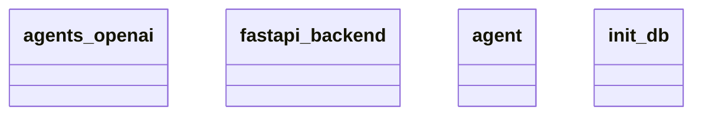

# Architecture Overview

## Component/Module Design

The architecture consists of four main components/modules represented in the class diagram:

1. **agents_openai**: This module likely acts as an interface or a key component for integrating OpenAI's services or functionalities within the larger application, possibly enabling the use of AI-driven capabilities.

2. **fastapi_backend**: This module appears to be the backbone of the application, providing the necessary infrastructure to build and manage web APIs. FastAPI is known for its asynchronous capabilities and rapid performance, indicating that this component may handle incoming requests and serve responses effectively.

3. **agent**: The role of the agent module is somewhat abstract based on the class name alone, but it might encapsulate the logic or behavior of specific agents that interact with either the user or the OpenAI services through the above modules. This could involve decision-making processes or state management within the application.

4. **init_db**: This module suggests a responsibility for initializing the database, which may involve setting up connections, schemas, or initial data necessary for the application to function correctly.

## Module Interactions

While the exact interactions between these components are not detailed in the diagram, we can infer the following relationships based on their names and typical design patterns:

- **fastapi_backend** likely serves as the central point through which client requests are processed, and it may call upon **agents_openai** for specific AI interactions. 
- The **agent** module could be initiated or used within the **fastapi_backend** to manage various user requests and possibly handle communication with the OpenAI services through **agents_openai**.
- **init_db** would typically be called at the start-up of the application to set up the necessary database environment before any other components attempt to access the database.

## Mermaid Diagram

Here is the generated Mermaid diagram that visually represents the modules:

## Conclusion

In summary, the architecture is organized into distinct components that suggest a separation of concerns, with roles that enable interaction with API and database functionalities. However, specifics about how each module communicates or interacts directly with others are not explicitly defined in the diagram.