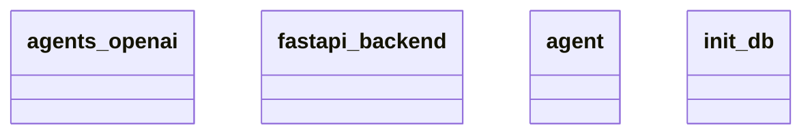

# Architecture Documentation

## Component Design

The architecture of the provided codebase consists of four primary modules:

1. **agents_openai**: This module likely interfaces with OpenAI's services, enabling interactions such as API calls for AI functionalities. It may include classes or functions dedicated to managing requests and responses.

2. **fastapi_backend**: This module serves as the backend framework for the application, leveraging FastAPI to handle web requests. It might include route definitions, middleware, and any necessary integrations to serve HTTP requests efficiently.

3. **agent**: This module appears to represent the core logic of individual agents within the application. Each agent might encapsulate behaviors or algorithms that define how they operate, possibly utilizing the capabilities provided by the `agents_openai` module.

4. **init_db**: This module is responsible for initializing the database. It likely includes functionalities to set up the database schema, populate initial datasets, or manage database connections needed for the application to function properly.

## Module Relationships and Interactions

- **agents_openai** and **agent** modules are likely related, where the `agent` class utilizes functionalities provided by the `agents_openai` to perform its tasks. Specifically, this suggests that agents might use OpenAI's capabilities as part of their operation.

- The **fastapi_backend** module interacts with both the `agents_openai` and `agent` modules. It likely serves as the entry point for client requests, processing those requests through agents that can call on OpenAI's services.

- The **init_db** module operates independently but is essential for the overall setup and stability of the application. It initializes the database that the **fastapi_backend** might use to store or retrieve data related to agents or interactions.

No direct relationships between **init_db** and other modules are indicated, implying it is primarily a setup utility that supports the functioning of the other components.

## Diagram Representation

Below is the Mermaid class diagram representing the architecture of the components:

In summary, this architecture features a clear delineation of responsibilities across modules, enabling organized development and separation of concerns, which enhances maintainability and scalability of the application.