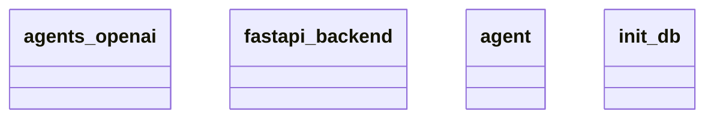

# Architecture Documentation

## Component/Module Design

The architecture consists of the following modules:

1. **agents_openai**: This module likely interacts with OpenAI's services, potentially managing requests to AI models and handling responses.

2. **fastapi_backend**: This is a backend framework built using FastAPI, a Python web framework that is designed to provide high performance and ease of use for building APIs. It probably serves as the central interface for communication between the client and the various services.

3. **agent**: This module may represent a specific AI agent that performs tasks or operations based on input, leveraging functionalities from `agents_openai`. It could include logic for processing inputs and returning outputs.

4. **init_db**: This module is responsible for initializing a database. It likely sets up necessary schemas and configurations required for the application's data storage needs.

## Module Relationships and Interactions

Based on the provided context from the Mermaid diagram, the relationships between the modules can be summarized as follows:

- **fastapi_backend**: Acts as the core of the application, likely facilitating HTTP requests and routing them to the appropriate handlers. It may communicate directly with `agent` to process requests and send responses back to clients.

- **agents_openai**: This module probably works in conjunction with `agent` to enhance its capabilities by providing insights or answers from OpenAI's models. The interaction is likely to be a call-and-response pattern where `agent` sends requests to `agents_openai`.

- **agent**: Represents the logic that integrates with both `fastapi_backend` and `agents_openai`, processing input from clients and managing output using the responses obtained from `agents_openai`.

- **init_db**: This module serves a crucial role in setting up the database but does not seem to have a direct interaction illustrated with the other components in the diagram. Its primary function is to establish the database environment necessary for persisting data that may be used by `agent` and potentially other modules.

## Mermaid Diagram

Here is the generated Mermaid diagram, illustrating the components mentioned:

In summary, the architecture reflects a structured approach where a FastAPI backend facilitates communication and dispatches requests to an AI agent that leverages OpenAI's services, while an initialization module sets up the database environment. The direct relationships between the components can be inferred based on their roles, although explicit interactions are not illustrated in detail in the provided diagram.