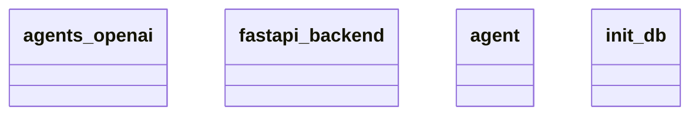

# Architecture Documentation

## Component/Module Design

The architecture consists of four main components, represented as classes in the provided Mermaid diagram:

1. **agents_openai**: This module likely handles the integration with OpenAI's APIs, allowing the application to utilize various AI capabilities, such as natural language processing or machine learning tasks.

2. **fastapi_backend**: This component serves as the web framework for exposing the application's APIs. FastAPI is known for its performance and ease of use for building RESTful services, indicating that this module is crucial for handling incoming requests and routing them to the appropriate services.

3. **agent**: This class appears to represent an individual agent in the system, possibly encapsulating behaviors or functionalities pertaining to an AI agent. This could involve processing requests, making decisions based on input, or interacting with other components.

4. **init_db**: This module is responsible for initializing the database connection and setting up the necessary schema to store and manage data used by the application. It is critical for ensuring that the application can persist data across sessions.

## Module Relationships and Interactions

The provided diagram does not explicitly illustrate relationships, such as inheritance or direct interactions between the classes. However, we can deduce some interactions based on the roles of each component:

- The **fastapi_backend** likely communicates with both the **agents_openai** and **agent** components. It processes incoming requests, which could involve invoking the functionality of these two classes to handle tasks or return responses.

- The **agent** might internally utilize the **agents_openai** class to perform specific AI-driven tasks that depend on OpenAI's capabilities, thereby establishing a functional relationship where the agent delegates AI-related functionalities.

- The **init_db** module is probably utilized during the application's startup phase, providing the necessary database connections and schema management required by other modules, especially by the **fastapi_backend** for data persistence.

## Generated Mermaid Diagram

## Conclusion

The architecture consists of four distinct but interrelated components aimed at building an AI-driven web application. However, the diagram does not provide explicit details on the interactions or relationships between the classes beyond the logical roles we have deduced. Further details, such as method calls or data flows, are necessary for a complete understanding of the system's design and behavior.