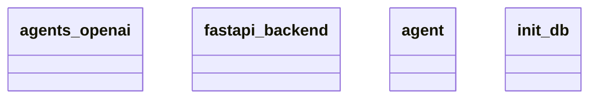

# Architecture Documentation

## Component/Module Design

The architecture comprises the following components/modules:

1. **agents_openai**: This module likely interacts with OpenAI's APIs or models. It is responsible for processing requests to and from OpenAI, handling responses, and possibly managing the logic for querying AI-generated content.

2. **fastapi_backend**: This is the backend framework for building web APIs, indicating that the application serves requests through this framework. It handles incoming HTTP requests, processes them, and returns appropriate responses. The FastAPI framework is known for its speed and efficiency.

3. **agent**: This component probably represents an abstraction or interface for various agents used in the application. It could manage the behavior of agents in conjunction with the OpenAI interactions.

4. **init_db**: This module is responsible for initializing and possibly configuring the database that the application uses. It lays the groundwork for data persistence and management, ensuring that the application has a database ready for use.

## Module Relationships and Interactions

The relationship and interaction among the modules are as follows:

- **fastapi_backend** is the central component that likely interfaces with incoming client requests. It may call upon the **agents_openai** to handle requests related to AI processing, invoking the relevant functionality and responses provided by that module.

- **agent** may serve as an intermediary, orchestrating interactions between **fastapi_backend** and **agents_openai**. It encapsulates the logic pertaining to agent behaviors which are influenced by or require data from the OpenAI interactions.

- **init_db** supports the entire architecture by ensuring the database is properly set up for use by other components. While the diagram does not show direct interactions, it can be inferred that data managed by **agents_openai** and **agent** would interact with the database initialized by **init_db**.

Overall, the architecture seems to follow a structured approach where the FastAPI framework serves as the main entry point, while the functionality is distributed among specific modules that manage AI interactions and database initialization.

## Mermaid Diagram

Here is the provided Mermaid diagram representing the architecture:

### Observations

The relationships between the components are not clearly delineated in the diagram; it shows the modules but does not provide explicit connections or interactions. This limits the degree to which we can map out the specific paths or dependencies between them without speculating beyond what the diagram conveys.