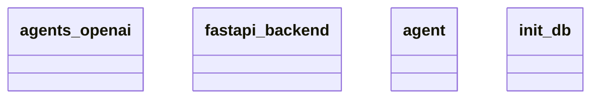

# Architecture Documentation

## Component/Module Design

The architecture consists of four key components or modules, as derived from the provided Mermaid diagram:

1. **agents_openai**: This module likely serves as an interface or integration layer for OpenAI's services or functions. It is responsible for managing interactions with OpenAI, allowing other components of the system to utilize its capabilities.

2. **fastapi_backend**: This module serves as the web framework backend for the application, built using FastAPI. It is likely responsible for handling HTTP requests, routing them to the relevant components, and serving responses back to the client. FastAPI's efficiency makes it suitable for asynchronous operations, which may optimize the app's performance.

3. **agent**: This module seems to represent the core logic or business rules of the application. It could encapsulate the primary operations performed by the agents, possibly orchestrating interactions between the other components, such as requests made to OpenAI via the `agents_openai` module.

4. **init_db**: This module is likely responsible for initializing or configuring the database. It may handle the setup of database connections, schemas, and ensuring that the database is ready for the application to use.

## Module Relationships and Interactions

Based on the Mermaid diagram, the relationships between the modules are not explicitly detailed within the diagram itself; thus, the exact interactions are not clearly defined. However, we can infer potential interactions based on their names and typical usage patterns:

- **fastapi_backend** likely interacts with **agent** to process incoming requests. The agent might handle the business logic and communication with both the `agents_openai` and `init_db` modules.
  
- **agent** is expected to utilize **agents_openai** to perform tasks that involve OpenAI's capabilities, such as generating responses or processing information.

- **init_db** would presumably be called during the application startup by **fastapi_backend** to ensure that the database is set up before any requests are processed.

While the specific relationships and interactions are inferred, it’s clear that the architecture is modular, with a focus on separating different concerns (e.g., database initialization, agent behavior, backend web serving).

## Mermaid Diagram

Here is the generated Mermaid diagram that illustrates the components:

This diagram presents the class names but does not provide detailed relationships or interactions between the modules. Thus, the analysis is based solely on logical inferences from the component names and their likely functionalities.