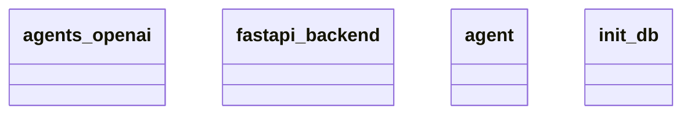

# Architecture Documentation

## Component/Module Design

The architecture consists of four primary components, each represented as a class in the provided Mermaid diagram:

1. **agents_openai**: This module is likely responsible for handling interactions with OpenAI's API or services. It could involve functions related to requesting responses or handling tokens during communication with OpenAI's models.

2. **fastapi_backend**: This module serves as the web framework backend for the application, likely implemented using FastAPI. It would manage HTTP requests and responses, define endpoints for various functionalities, and facilitate communication between the frontend and the backend system.

3. **agent**: This component probably represents the core logic of the agent functionality within the application. It may encapsulate behaviors, state management, and methods that define how the agent interacts with users or processes data.

4. **init_db**: This module is likely tasked with database initialization operations. It would include functions to set up database connections, create necessary tables, and ensure that the database schema adheres to the application's requirements.

## Module Relationships and Interactions

The relationship between these modules can be inferred based on their names and typical roles within a system:

- **fastapi_backend** acts as the central point that coordinates interactions between the client (frontend), **agents_openai**, **agent**, and **init_db**. It handles incoming requests, making it the entry point for user actions that involve agents.

- **agents_openai** and **agent** likely work closely together, where **agents_openai** handles communication with OpenAI services, and the **agent** may utilize these responses to perform its logic and provide outputs to the user through the FastAPI endpoints.

- **init_db** would interact with **fastapi_backend** to ensure that the backend can properly connect and interact with the database, performing necessary setup before requests can be reliably processed.

## Mermaid Diagram

Below is the generated Mermaid diagram representing the architecture:

## Relationship Clarity

The exact nature of the relationships and interactions between classes is not explicitly articulated in the provided diagram. Therefore, while we can infer typical relationships based on naming conventions and common architectural patterns, the specifics of how these modules communicate or share data cannot be confirmed without additional documentation or code insights. Thus, only inferred interactions based on standard practices have been discussed.