# Architecture Overview
The system architecture consists of a FastAPI backend that interacts with OpenAI agents to provide various functionalities related to study management. The architecture supports a modular design where different components communicate over defined APIs, facilitating data exchange and enhancing maintainability.

## System Architecture Diagram

```mermaid
flowchart TD
    fastapi_backend --> agents_openai
    agent -.->|external| metadata
    agent -.->|external| mode
    agent -.->|external| topic_id
    fastapi_backend -.->|external| _api_connection_details
    fastapi_backend -.->|external| _api_create_topic
    fastapi_backend -.->|external| _api_current_session
    fastapi_backend -.->|external| _api_current_topic
    fastapi_backend -.->|external| _api_give_more_info
    fastapi_backend -.->|external| _api_improvement_areas
    fastapi_backend -.->|external| _api_next_up_topics
    fastapi_backend -.->|external| _api_study_goals
    fastapi_backend -.->|external| _api_study_metrics
    fastapi_backend -.->|external| _api_study_planner
    fastapi_backend -.->|external| _api_study_sessions
    fastapi_backend -.->|external| _api_topic_progress
    fastapi_backend -.->|external| _api_topics
    fastapi_backend -.->|external| _api_upload_study_material
    fastapi_backend -.->|external| http___localhost_3000
    fastapi_backend -.->|external| lesson_id
    fastapi_backend -.->|external| metadata
    fastapi_backend -.->|external| mode
    fastapi_backend -.->|external| session_id
    fastapi_backend -.->|external| topic_id
```

Below is the generated architecture diagram that illustrates the interactions between the main components of the system.

### Diagram Components:
- **FastAPI Backend**: The core server that handles requests and responses, processes the business logic, and communicates with the OpenAI agents.
- **Agents OpenAI**: External agents that handle complex interactions and respond to queries based on study materials and user data.
- **API Endpoints**: Various endpoints for creating topics, managing sessions, uploading study materials, and retrieving progress, which are signified by the dashed lines and associated labels. 

## Technology Stack
The following technologies are utilized in the project:
- **FastAPI**: A modern web framework for building APIs with Python 3.6+ based on standard Python-type hints. It allows automatic generation of OpenAPI and JSON Schema documentation.
- **OpenAI API**: For AI-driven functionalities in study assistance provided by the OpenAI agents.
- **Python**: As the primary programming language for implementing the backend logic.
- **Docker (assumed)**: Commonly used for containerizing applications, ensuring consistent environments for deployment (not explicitly mentioned but inferred).

## Component Architecture
The primary components of the system include:

1. **FastAPI Backend**: 
   - **Responsibilities**: It acts as the server, handling HTTP requests from clients, processing data, and interacting with the agents for AI responses. It includes various APIs for topic management, session handling, and study metrics.

2. **OpenAI Agents**: 
   - **Responsibilities**: These agents perform behind-the-scenes processing, leveraging AI functionalities to provide intelligent responses and insights based on user interactions.

### Interaction
FastAPI facilitates requests to and from OpenAI agents through multiple endpoints, allowing for a rich set of functionalities focused on study management, tracking, and support.

## Data Architecture
Data management patterns and storage solutions were not explicitly detailed in the provided information, but given the nature of FastAPI and its likely interaction with databases:
- **Relational/NoSQL Database**: Likely used for storing topics, sessions, and user data, although specific implementations are not observed in the codebase.

## API Architecture
A variety of API endpoints are defined, as indicated in the architecture diagram, including:
- **_api_create_topic**: Manages the creation of new study topics.
- **_api_current_session**: Retrieves the currently active study session.
- **_api_study_goals**: Allows users to set or update their study goals.
- **_api_upload_study_material**: Facilitates uploading educational content.

## Security Architecture
No specific security details, such as authentication or authorization mechanisms, were noted in the current codebase. Implementing security measures like API keys or OAuth for the OpenAI integration would be advisable.

## Deployment Architecture
While not specified in the provided details, common practices such as:
- **Containerization**: Likely assumed with Docker for running the FastAPI application.
- **Cloud Deployment**: Potentially using platforms like AWS, Azure, or Google Cloud for hosting the application and handling scaling.

## Architectural Patterns
- **Microservices Architecture**: The system demonstrates a microservices-like approach where FastAPI and OpenAI agents are separated, allowing for independent scalability and maintenance.
- **RESTful API**: The design heavily relies on REST principles, utilizing endpoints for CRUD operations.

## Key Design Decisions
1. **Use of FastAPI**: Chosen for its performance and ease of creating APIs with async capabilities, which is crucial for handling multiple requests efficiently.
2. **Integration with OpenAI**: Leveraging cutting-edge AI technology to enhance user interaction and provide intelligent study support, aligning with modern educational technology trends.

This architectural documentation aims to capture the essence of the project based on the codebase analysis and should serve as a reference for current and future developers working on the project.