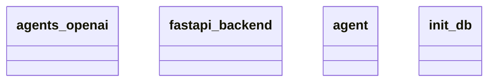

# Architecture Documentation

## Component/Module Design

The architecture consists of four main components/modules:

1. **agents_openai**: This module is likely designed to interface with OpenAI's API to utilize AI capabilities. It could handle tasks such as natural language processing or generating responses based on user input.

2. **fastapi_backend**: This module serves as the backend framework utilizing FastAPI. It is likely responsible for handling incoming requests, routing them appropriately, and managing interactions between the client side and the various backend services.

3. **agent**: This component likely represents the logic or workflows for handling specific tasks assigned to the AI agents. It's where the AI processes the requests and interacts with the OpenAI services.

4. **init_db**: This module appears to be responsible for database initialization. It might include logic to set up the database schema, seed initial data, or ensure the database is ready to support the application's operations.

## Module Relationships and Interactions

The relationships between the modules are likely structured as follows:

- The **fastapi_backend** acts as a central hub that facilitates communication between the user inputs and the other modules. It handles incoming requests from the client and routes them to the correct module (either **agents_openai** or **agent**).

- The **agents_openai** module likely receives requests via the **fastapi_backend**, processes them using the OpenAI API, and then returns the results back through the backend to the client.

- The **agent** module may interact closely with both **agents_openai** and **init_db**. It could leverage the database initialization logic to manage data persistency for the actions or results processed by the agents.

- The **init_db** component is primarily involved in ensuring the necessary database connections and schema are established, possibly running at application startup before any interactions between the other modules occur.

## Generated Mermaid Diagram

In this diagram, each class represents a module in the architecture. The arrows and relationships between classes are not explicitly defined in this diagram, thus, their direct interactions cannot be conclusively interpreted. However, based on the descriptions, it is plausible to infer that they communicate primarily through the **fastapi_backend**, with **agents_openai** and **agent** serving distinct roles in processing requests and managing AI interactions. The **init_db** clearly has a supportive role in database setup.

Overall, the system presents a modular design that clearly separates concerns, promoting better maintainability and scalability. However, specific relationship details remain unclear without additional context or annotations in the diagram.