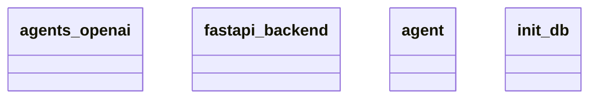

# Architecture Documentation

## Component/Module Design
The architecture consists of the following key components/modules:

1. **agents_openai**: This module is likely responsible for interacting with the OpenAI API, making requests, and processing responses related to AI agent functionalities.

2. **fastapi_backend**: This serves as the backend framework for the project, utilizing the FastAPI library to create a web server that can handle incoming requests, route them to the appropriate handlers, and return responses.

3. **agent**: This module likely encapsulates the logic for individual agents, defining their behaviors, states, and interactions within the broader system.

4. **init_db**: This module is responsible for initializing the database, setting up tables, and preparing the environment for data storage and retrieval, which is crucial for maintaining application data.

## Module Relationships and Interactions
Based on the provided diagram, the modules may interact as follows:

- The **fastapi_backend** likely serves as the entry point for all web requests, possibly consuming functionalities from the **agents_openai** and **agent** modules to fulfill the requests. It could route specific endpoints that invoke actions from these components to respond appropriately to client interactions.

- The **agent** module may leverage the **agents_openai** module to implement capabilities that involve AI interactions, utilizing OpenAI's features for enhanced functionality.

- The **init_db** module operates independently to set up the necessary database structures that both the **fastapi_backend** and the **agent** modules may depend on for persistence.

## Mermaid Diagram
Below is the generated Mermaid class diagram that visually represents the components and their relationships.

## Summary
The architecture emphasizes modularity, defining clear roles for each component, including handling web requests, managing AI functionalities, and database initialization. While the specific interactions are not exhaustively detailed in the diagram, it can be inferred that the **fastapi_backend** serves as a central hub connecting the various components. Relationships beyond this inference are not explicitly clear from the provided context.