# Architecture Overview
The architecture of the system revolves around a FastAPI backend that serves as the core processing unit. It interacts with various external components and APIs to provide a suite of functionalities. The architecture is designed to facilitate communication between the backend and a user interface, while managing study-related tasks through various endpoints.

## System Architecture Diagram

```mermaid
flowchart TD
    fastapi_backend --> agents_openai
    agent -.->|external| metadata
    agent -.->|external| mode
    agent -.->|external| topic_id
    fastapi_backend -.->|external| _api_connection_details
    fastapi_backend -.->|external| _api_create_topic
    fastapi_backend -.->|external| _api_current_session
    fastapi_backend -.->|external| _api_current_topic
    fastapi_backend -.->|external| _api_give_more_info
    fastapi_backend -.->|external| _api_improvement_areas
    fastapi_backend -.->|external| _api_next_up_topics
    fastapi_backend -.->|external| _api_study_goals
    fastapi_backend -.->|external| _api_study_metrics
    fastapi_backend -.->|external| _api_study_planner
    fastapi_backend -.->|external| _api_study_sessions
    fastapi_backend -.->|external| _api_topic_progress
    fastapi_backend -.->|external| _api_topics
    fastapi_backend -.->|external| _api_upload_study_material
    fastapi_backend -.->|external| http___localhost_3000
    fastapi_backend -.->|external| lesson_id
    fastapi_backend -.->|external| metadata
    fastapi_backend -.->|external| mode
    fastapi_backend -.->|external| session_id
    fastapi_backend -.->|external| topic_id
```

The architecture diagram clearly depicts the relationship between different components of the system:

### Explanation of Components
- **FastAPI Backend**: This is the main application that handles incoming requests and processes them.
- **Agents OpenAI**: This component seems to interact with an AI service for additional functionalities.
- **External APIs**: Various endpoints are listed as external components, indicating that the FastAPI backend communicates with them for specific features like session management, topic progress, study metrics, and more.

## Technology Stack
- **FastAPI**: A modern web framework for building APIs with Python based on standard Python type hints. It is known for its performance and ease of use.
- **OpenAI API**: Integrated for providing artificial intelligence functionalities within the application.

## Component Architecture
1. **FastAPI Backend**:
   - **Responsibilities**: Handles incoming requests, manages user sessions, creates and manages topics, and serves as an intermediary between the user interface and data sources. It also interfaces with the OpenAI service for enhanced functionalities.
   - **Interactions**: It interacts with various external APIs to perform operations related to study goals, metrics, topics, and sessions.

2. **OpenAI Agents**:
   - **Responsibilities**: Provides AI-related capabilities that augment the primary functionalities of the application.
   - **Interactions**: It communicates with the FastAPI backend to process data requests and provide insights.

## Data Architecture
The codebase does not currently exhibit a dedicated data storage solution or database schema. However, the presence of API endpoints suggests there may be data flow patterns and entities involved in managing study sessions, goals, topics, and user information that would typically be stored in a database.

## API Architecture
The FastAPI backend offers a variety of RESTful endpoints, including:
- **_api_create_topic**: Endpoint to create new study topics.
- **_api_current_session**: Endpoint to retrieve information about the current study session.
- **_api_study_goals**: Endpoint to manage study goals.
- Additional endpoints manage topics, metrics, and session data.

## Security Architecture
Details on security measures are not explicitly mentioned in the code. It's essential to ensure that authentication and authorization mechanisms are implemented as per best practices, especially when dealing with sensitive user data.

## Deployment Architecture
There is no explicit deployment architecture indicated in the documentation. However, utilizing FastAPI suggests that it could be deployed on platforms that support Python applications, such as cloud services (e.g., AWS, Heroku) or within a containerized environment (e.g., using Docker).

## Architectural Patterns
The architecture follows a layered approach where the FastAPI backend acts as a service layer exposing APIs for interaction. This allows for clear separation of concerns and easy scalability.

## Key Design Decisions
- **Use of FastAPI**: Selected for its performance and simplicity in building APIs.
- **Integration with OpenAI**: To provide enhanced AI capabilities within the application.

This architectural documentation provides a comprehensive overview based on the codebase analysis. Further details regarding deployment and data storage may need to be explored within the broader context of the application.