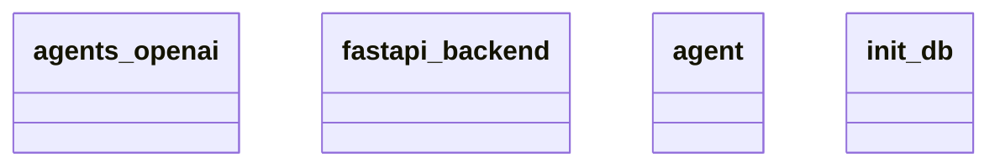

# Architecture Documentation

## Component/Module Design

The architecture consists of four primary components/modules, each serving a distinct purpose within the overall system:

1. **agents_openai**: This module likely interacts with the OpenAI API or services, facilitating communication and operations with OpenAI's offerings. It may handle the setup and requests to generate or process data using AI models.

2. **fastapi_backend**: This module serves as the backend framework, potentially implementing a RESTful API built with FastAPI. It likely handles incoming requests, routes them to appropriate handlers, and manages responses to clients.

3. **agent**: This module seems to represent individual agents or instances that may have specific roles or functionalities within the architecture. It could be responsible for logic pertaining to the operations each agent performs within the ecosystem.

4. **init_db**: This module is presumably responsible for database initialization, setting up the schema, and preparing the database to be ready for data operations. It likely includes the logic to configure and connect to a database.

## Module Relationships and Interactions

Based on the Mermaid diagram, the relationships and interactions between these components/modules are not explicitly defined. However, we can infer some potential interactions:

- The **fastapi_backend** likely serves as the central communication hub, interacting with the other modules (like **agents_openai** and **agent**) to fulfill requests from clients. 
- The **init_db** module would be invoked during the startup phase of the application, ensuring that the database is set up before the **fastapi_backend** starts handling requests.
- The **agents_openai** and **agent** modules may interact with each other as well, with the **agent** performing operations that involve generating or utilizing data processed through OpenAI's services.

However, the specifics of these interactions, such as what methods are called and the data flow between modules, are not detailed in the provided information.

## Mermaid Diagram

This diagram depicts the various components of the system but does not illustrate any explicit relationships or hierarchies between them. The connections and data flow would require further detail to provide a complete overview.