# Architecture Overview

The architecture of the system is designed around a FastAPI backend, which serves as the core for handling requests and orchestrating interactions with various external services and APIs. This architecture supports a modular approach where different components handle specific functionalities such as topic management, study goals, and session tracking, thereby promoting separation of concerns and scalability.

## System Architecture Diagram

```mermaid
flowchart TD
    fastapi_backend --> agents_openai
    agent -.->|external| metadata
    agent -.->|external| mode
    agent -.->|external| topic_id
    fastapi_backend -.->|external| _api_connection_details
    fastapi_backend -.->|external| _api_create_topic
    fastapi_backend -.->|external| _api_current_session
    fastapi_backend -.->|external| _api_current_topic
    fastapi_backend -.->|external| _api_give_more_info
    fastapi_backend -.->|external| _api_improvement_areas
    fastapi_backend -.->|external| _api_next_up_topics
    fastapi_backend -.->|external| _api_study_goals
    fastapi_backend -.->|external| _api_study_metrics
    fastapi_backend -.->|external| _api_study_planner
    fastapi_backend -.->|external| _api_study_sessions
    fastapi_backend -.->|external| _api_topic_progress
    fastapi_backend -.->|external| _api_topics
    fastapi_backend -.->|external| _api_upload_study_material
    fastapi_backend -.->|external| http___localhost_3000
    fastapi_backend -.->|external| lesson_id
    fastapi_backend -.->|external| metadata
    fastapi_backend -.->|external| mode
    fastapi_backend -.->|external| session_id
    fastapi_backend -.->|external| topic_id
```

Here is the generated architecture diagram representing the system components and their interactions:

### Explanation of the Diagram
- **fastapi_backend**: The main backend component built using FastAPI, responsible for processing requests and managing business logic.
- **agents_openai**: Indicates integration with OpenAI agents for enhanced capabilities.
- **external nodes** (e.g., `_api_create_topic`, `_api_current_session`, etc.): These represent various API endpoints that the FastAPI backend interacts with for functionality such as managing study topics, sessions, and metrics.
- **agent**: Represents an external interaction point for different metadata, modes, and identifiers.

## Technology Stack
The technology stack used in the codebase includes:

- **FastAPI**: A modern web framework for building APIs with Python, known for its fast performance and easy-to-use design.
- **OpenAI API**: Integration for utilizing OpenAI's AI capabilities within the application.
- **Database**: Although not explicitly mentioned in the flow diagram, the system likely utilizes a database for storing user data, session details, and study materials.

## Component Architecture
1. **FastAPI Backend**: 
   - Manages API requests and responses.
   - Orchestrates data flow from the frontend to the database and external APIs.
   - Implements business logic for study planning and session management.

2. **OpenAI Agents**:
   - Handles natural language processing and user interaction, leveraging OpenAI services.

3. **External API Connections**:
   - Interfaces with various APIs to provide functionalities such as topic creation, current session retrieval, and integration with third-party services.

## Data Architecture
The data architecture elements include:
- **Database**: Responsible for storing information about study topics, sessions, and user metrics.
- **Data Flow**: Requests from the frontend communicate with the backend, which queries the database and external APIs to provide responses to the user.

## API Architecture
The system provides several API endpoints such as:
- **POST /api/create_topic**: Creates a new study topic.
- **GET /api/current_session**: Retrieves the current study session.
- **GET /api/topics**: Lists all topics available for study.
These endpoints follow RESTful conventions, utilizing standard HTTP methods to manage resources.

## Security Architecture
Although not explicitly detailed in the codebase, typical security measures could include:
- Authentication (e.g., using OAuth tokens)
- Authorization checks to ensure users have access to specific API functionalities.

## Deployment Architecture
Deployment architecture specifics have not been provided, but common practices in deploying FastAPI applications include:
- Using Docker for containerization.
- Utilizing platforms such as AWS or Heroku for hosting.
- Setting up CI/CD pipelines for automated deployment tests and deployments.

## Architectural Patterns
The architecture follows a modular, layered approach. The main patterns observed include:
- **Microservices**: Components function independently and communicate through APIs.
- **RESTful Services**: Adhering to REST principles for API design.
- **Separation of Concerns**: Clear distinction between backend logic, external API calls, and data management.

## Key Design Decisions
- The choice of **FastAPI** allows for high performance and easy development of RESTful APIs.
- Integration with **OpenAI** showcases a push towards incorporating advanced AI capabilities.
- The modular approach supports future scalability and easy maintenance as new features are added.

This architectural documentation captures essential insights based on the codebase provided and defines a clear understanding of its structure and functionalities.