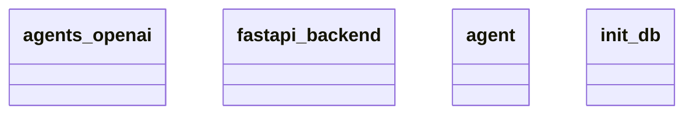

# Architecture Documentation

## Component/Module Design
The system comprises four main modules as represented in the Mermaid diagram:

1. **agents_openai**: This module likely serves as an interface for interacting with OpenAI APIs or models, enabling functionalities related to AI-driven predictions or responses.

2. **fastapi_backend**: This module is likely the backend framework that handles HTTP requests and responses. FastAPI is designed for building APIs quickly and efficiently, indicating this module might manage user interactions and relay information between the frontend and other services.

3. **agent**: This module likely represents the central logic or algorithms that define the behavior of an agent within the system. It may encapsulate methods for processing input and generating output using either predefined rules or AI models.

4. **init_db**: This module appears to deal with the database initialization process. Its primary role likely involves setting up connections, schemas, or migrations required for the database the application uses. 

## Module Relationships and Interaction
The relationships and interactions among the modules can be inferred, but there are no explicit connections shown in the diagram itself. Therefore, we can summarize the following relationships based on typical design patterns:

- **fastapi_backend** would most likely interact with **agents_openai** to make or receive requests related to AI functionalities, sending and receiving data as needed.
  
- The **agent** module is probably dependent on both **agents_openai** and **fastapi_backend**. It would need to call the functionality provided by **agents_openai** to perform detailed processing or decisions based on AI responses, while also interacting with **fastapi_backend** to relay information back to the user.

- **init_db** is likely utilized during application startup to prepare the database environment. It is expected to be invoked by the **fastapi_backend** module during the initialization phase, ensuring that the database is ready to handle incoming requests.

However, specific directional relationships, such as whether modules inherit from each other or the nature of their interactions, cannot be deduced from the diagram alone.

## Mermaid Diagram
Here is the generated Mermaid class diagram representing the system:

In conclusion, while the provided diagram outlines the key components of the system, the precise interactions and relationships still require additional context to fully understand the dynamic between these modules.