# Architecture Documentation

## Architecture Overview
This document provides an architectural overview of a web application that interacts with an external API service. The application is built using the FastAPI framework on the backend. The architecture facilitates various operations such as session management, topic management, and study metrics by exposing a set of RESTful API endpoints. Components interact primarily through the FastAPI backend, which forwards requests to external services when necessary.

## System Architecture Diagram

```mermaid
flowchart TD
    fastapi_backend --> agents_openai
    agent -.->|external| metadata
    agent -.->|external| mode
    agent -.->|external| topic_id
    fastapi_backend -.->|external| _api_connection_details
    fastapi_backend -.->|external| _api_create_topic
    fastapi_backend -.->|external| _api_current_session
    fastapi_backend -.->|external| _api_current_topic
    fastapi_backend -.->|external| _api_give_more_info
    fastapi_backend -.->|external| _api_improvement_areas
    fastapi_backend -.->|external| _api_next_up_topics
    fastapi_backend -.->|external| _api_study_goals
    fastapi_backend -.->|external| _api_study_metrics
    fastapi_backend -.->|external| _api_study_planner
    fastapi_backend -.->|external| _api_study_sessions
    fastapi_backend -.->|external| _api_topic_progress
    fastapi_backend -.->|external| _api_topics
    fastapi_backend -.->|external| _api_upload_study_material
    fastapi_backend -.->|external| http___localhost_3000
    fastapi_backend -.->|external| lesson_id
    fastapi_backend -.->|external| metadata
    fastapi_backend -.->|external| mode
    fastapi_backend -.->|external| session_id
    fastapi_backend -.->|external| topic_id
```

The architecture diagram below represents the components and their interactions within the system.

### Diagram Explanation
- **fastapi_backend**: The core component of the architecture, responsible for handling requests, managing sessions, and coordinating between external services.
- **agents_openai**: An external service that likely interacts with OpenAI agents for processing requests.
- **External Elements**: Various API endpoints `_api_*` represent specific functionalities exposed by the backend, such as session management (`_api_current_session`), topic creation (`_api_create_topic`), and metrics (`_api_study_metrics`).

## Technology Stack
1. **FastAPI**: A web framework for building APIs with Python based on standard Python type hints. It is used for developing the backend service.
2. **OpenAI**: The agents might use OpenAI's services for handling various AI-driven tasks.
3. **Dependencies**: Specific libraries and packages were not detailed in the observed code, but typical packages may include HTTP clients, database libraries, and environment management tools.

## Component Architecture
### Main Components:
- **fastapi_backend**:
  - **Responsibilities**: Manages the API endpoints, coordinates the interaction between the client and external services, processes incoming requests, and returns responses.
  - **Interactions**: It communicates indirectly with other services and APIs as needed to fulfill requests.
  
### External Components:
- **agents_openai**: Works independently to process data or return responses based on the input provided to it.

## Data Architecture
The data architecture maintains interactions with external APIs. The detailed database schemas were not visible in the provided architecture; therefore, specific storage details cannot be highlighted. Data flow patterns primarily follow REST API conventions where data is requested and submitted through endpoints.

## API Architecture
The FastAPI architecture exposes various API endpoints for interacting with the application:
- `/api/create_topic`
- `/api/current_session`
- `/api/study_metrics`
- Other related endpoints for managing study materials and sessions.

## Security Architecture
No explicit security measures such as authentication or authorization could be identified from the architecture provided. It is important to consider implementing such mechanisms in production systems to protect sensitive data.

## Deployment Architecture
The specific deployment architecture (containerization, CI/CD processes, and cloud services) was not detailed in the observed codebase. Standard deployments could involve Docker containers for the FastAPI application, and potential cloud hosting could include services like AWS, Azure, or Google Cloud.

## Architectural Patterns
The architecture appears to follow a RESTful service model typical of modern web applications. There are indications of layered architecture, where the FastAPI backend serves as a buffer to process and route requests.

## Key Design Decisions
- **Using FastAPI**: Selected for its performance and ease of use, allowing for type validation and automatic generation of API documentation.
- **External Service Integration**: The design leverages external APIs to enhance functionality, particularly involving AI through OpenAI services.

This documentation reflects the architecture as observed from the provided codebase and architectural diagram. Further details about specific implementations would require additional insights into the code and configurations.