# Architecture Overview
This document provides a comprehensive architectural overview of the software system, which utilizes a FastAPI backend integrated with numerous external APIs. The system is designed to facilitate interaction with various endpoints that manage topics, sessions, and study materials within an educational context.

## System Architecture Diagram

```mermaid
flowchart TD
    fastapi_backend --> agents_openai
    agent -.->|external| metadata
    agent -.->|external| mode
    agent -.->|external| topic_id
    fastapi_backend -.->|external| _api_connection_details
    fastapi_backend -.->|external| _api_create_topic
    fastapi_backend -.->|external| _api_current_session
    fastapi_backend -.->|external| _api_current_topic
    fastapi_backend -.->|external| _api_give_more_info
    fastapi_backend -.->|external| _api_improvement_areas
    fastapi_backend -.->|external| _api_next_up_topics
    fastapi_backend -.->|external| _api_study_goals
    fastapi_backend -.->|external| _api_study_metrics
    fastapi_backend -.->|external| _api_study_planner
    fastapi_backend -.->|external| _api_study_sessions
    fastapi_backend -.->|external| _api_topic_progress
    fastapi_backend -.->|external| _api_topics
    fastapi_backend -.->|external| _api_upload_study_material
    fastapi_backend -.->|external| http___localhost_3000
    fastapi_backend -.->|external| lesson_id
    fastapi_backend -.->|external| metadata
    fastapi_backend -.->|external| mode
    fastapi_backend -.->|external| session_id
    fastapi_backend -.->|external| topic_id
```

### Explanation of Components:
- **FastAPI Backend**: The primary component that processes requests and interacts with various external APIs to manage educational resources.
- **Agents OpenAI**: Represents the integration with OpenAI's services, likely for advanced content generation or learning assistance.
- **External APIs**: Several endpoints are defined, including APIs for managing topics, sessions, and study materials. These APIs facilitate interactions such as creating topics, uploading study materials, and monitoring study metrics.

## Technology Stack
- **FastAPI**: A modern web framework for building APIs with Python. It is designed to be fast (high performance) and easy to use.
- **OpenAI API**: Used for integrating AI functionalities within the application.
- **External Services**: Various unspecified external services that interact with the FastAPI backend to enhance functionalities such as session management and topic handling.

## Component Architecture
### Main Components:
1. **FastAPI Backend**: 
   - **Responsibilities**: Handle API routes, process requests, manage sessions, and interact with external services.
   
2. **Agents OpenAI**: 
   - **Responsibilities**: Provide AI-driven responses or assistance based on user queries or educational requests.

### Interactions:
- The FastAPI backend communicates with the OpenAI agents and numerous external APIs, handling incoming data and routing requests to the correct services or components based on user demands.

## Data Architecture
The documentation lacks specific details regarding data storage solutions and database schemas. However, it implies that the backend services likely manage stateful data related to educational sessions, topics, and user interactions through the integration of external APIs.

## API Architecture
The following API endpoints are observed:
- **_api_connection_details**
- **_api_create_topic**
- **_api_current_session**
- **_api_current_topic**
- **_api_give_more_info**
- **_api_improvement_areas**
- **_api_next_up_topics**
- **_api_study_goals**
- **_api_study_metrics**
- **_api_study_planner**
- **_api_study_sessions**
- **_api_topic_progress**
- **_api_topics**
- **_api_upload_study_material**

These endpoints likely adhere to RESTful conventions, allowing CRUD operations and contextual queries.

## Security Architecture
The documentation does not discuss specific security measures or patterns observed in the codebase. Therefore, the security approaches used (if any) remain unspecified.

## Deployment Architecture
There are no explicit details about deployment strategies or configurations found within the codebase. Thus, deployment architecture cannot be detailed.

## Architectural Patterns
The system prominently employs a **RESTful API** architecture pattern, enabling efficient client-server communication. The codebase's modular design suggests a layered architecture, where concerns are separated among various components.

## Key Design Decisions
While specific design decisions are not documented, the usage of FastAPI suggests a focus on performance and rapid development. The integration with OpenAI indicates a choice to enhance user interactivity through AI capabilities.