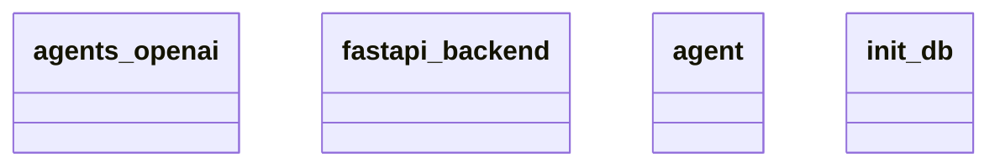

# Architecture Documentation

## Component/Module Design

The architecture consists of four key components/modules:

1. **agents_openai**: This module likely interacts with the OpenAI API, enabling functionalities related to artificial intelligence services. It could be responsible for sending prompts to the OpenAI models and processing responses.

2. **fastapi_backend**: Serving as the backbone of the application, this module is built on FastAPI, a modern web framework for building APIs with Python. It handles HTTP requests, manages routes, and may also be responsible for serving the user interface or API endpoints necessary for interaction with the application.

3. **agent**: This module appears to encapsulate the logic or representation of agents within the system. It may define the properties and behaviors of various agents (possibly including agents that utilize the OpenAI capabilities).

4. **init_db**: This module is likely concerned with database initialization, setting up schemas, and populating the database with necessary data. It is essential for ensuring the application's data layer is ready for use.

## Module Relationships and Interaction

Based on the provided context from the classes, the relationships and interactions between the modules can be summarized as follows:

- **fastapi_backend** would interact with **agents_openai** to handle requests that involve AI functionalities. For instance, when a user sends a request through the API, this module could process the request and leverage the **agents_openai** module to perform operations that require natural language processing or other AI-related tasks.

- The **agent** module may serve as a mediator between the **fastapi_backend** and **agents_openai**, managing how agents are instantiated and how their functionalities are invoked. It is indicative that there is an abstraction layer for working with agents that the backend utilizes.

- The **init_db** module plays a crucial role in preparing the application by ensuring that the database is set up before any other operations take place. It provides the necessary infrastructure that the other components (like **fastapi_backend** and **agent**) would depend on for storing and retrieving data.

## Mermaid Diagram

This diagram visually represents the architecture's components but does not explicitly show relationships between them. The interactions must be inferred based on the documented functionality of each module rather than directly observed from the diagram. Since relationships and interactions were not clearly defined, the above interpretations are based on typical use patterns seen in similar architectures.