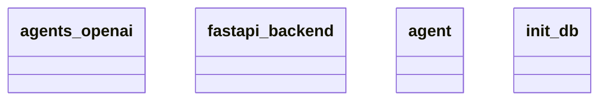

# Architecture Documentation

## Component/Module Design

The architecture consists of four main components or modules, as represented in the provided Mermaid diagram:

1. **agents_openai**: This module likely interacts with the OpenAI API, providing functionalities related to artificial intelligence or natural language processing.

2. **fastapi_backend**: This component serves as the web server backend built using FastAPI. It is responsible for handling incoming requests, routing them to the appropriate handlers, and returning responses.

3. **agent**: This module seems to encapsulate the logic for the agent itself. It might contain methods for decision-making, managing conversations, or processing input and output for the agent's interactions.

4. **init_db**: This component is responsible for initializing the database. It likely includes functions related to database setup, connection management, and possibly data seeding or migration tasks.

## Module Relationships and Interaction

The relationships between these modules based on the diagram can be interpreted as follows:

- **fastapi_backend** likely acts as the entry point for clients, processing requests and delegating them to the other modules as necessary. It might interact with both the **agents_openai** and **agent** modules to fulfill requests that require AI processing or agent behavior.

- The **agent** module could be utilized by the **fastapi_backend** to perform actions based on user input or interactions. 

- The **init_db** module would be invoked during application startup to ensure that the database is ready for any data operations that either **fastapi_backend** or the **agent** might perform.

- The relationships between modules are not defined in the diagram with arrows or other indicators, making it difficult to establish precise interaction points. However, it can be inferred that the **fastapi_backend** is central to the operational flow, while the other modules serve specialized functions that augment the backend's capabilities.

## Mermaid Diagram

Here is the generated Mermaid diagram that represents the architecture:

### Notes

- The relationships between the classes are not explicitly outlined in the diagram, leaving some aspects open to interpretation based on standard practices in modular architectures.