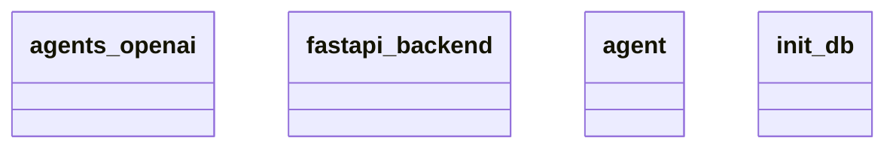

# Architecture Documentation

## Component/Module Design

The architecture consists of four main components/modules as illustrated in the provided Mermaid diagram:

1. **agents_openai**: This module likely serves as the interface or integration point for OpenAI's services, handling requests and responses related to the OpenAI API. It likely includes functionalities for sending prompts and receiving generated text or outputs.

2. **fastapi_backend**: This module appears to implement the backend functionality using the FastAPI framework, which is known for building APIs quickly and effectively. It might include route definitions, request handling, and response formatting, leveraging asynchronous capabilities for better performance.

3. **agent**: This module likely represents the core logic or functionality of the application, possibly encapsulating the behavior of an AI agent. It may include methods for processing data, interacting with users, and implementing decision-making processes.

4. **init_db**: This module likely handles database initialization and setup. It may include logic for creating tables, seeding initial data, or configuring database connections to ensure that the application has a properly set up database environment.

## Module Relationships and Interaction

The relationships and interactions between these modules are not explicitly depicted in the diagram. However, we can infer the following based on typical architectural patterns:

- The **fastapi_backend** module probably interacts with the **agents_openai** and **agent** modules to process incoming API requests and utilize OpenAI's functionality or the agent's behavior. 
- The **agent** module may depend on services from **agents_openai** to access external AI functionalities and respond based on processed data.
- The **init_db** module is likely called during the startup process of the application to prepare the database, making it a foundational component that sets up the environment for the other modules.

## Generated Mermaid Diagram

This diagram visualizes the main modules in the application architecture. The relationships and interactions can be interpreted, but specific dependencies or calling patterns are not detailed in the diagram itself. Further insights into the interactions would require a look at the code implementations within these modules.