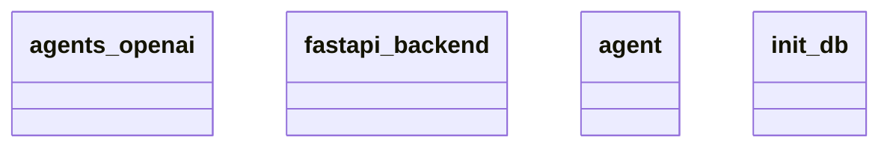

# Architecture Documentation

## Component/Module Design

The architecture consists of four main components:

1. **agents_openai**: This module is likely responsible for interfacing with OpenAI's API, facilitating communications and interactions that involve AI models or solutions provided by OpenAI.

2. **fastapi_backend**: This component serves as the backend service built using FastAPI, a modern web framework for building APIs with Python 3. It likely handles HTTP requests and responses, routing, and serving the application's core functionality.

3. **agent**: This module possibly represents a central entity in the application, responsible for managing or orchestrating interactions between various components, including the agents and the backend.

4. **init_db**: This module is likely focused on the initialization and setup of the database. This includes establishing connections, creating necessary tables, and seeding initial data as required by the application.

## Module Relationships and Interactions

Based on the provided diagram, the modules appear to have distinct responsibilities but may interact with each other in a structured manner. Here’s a possible outline of their interactions:

- The **fastapi_backend** would likely handle incoming requests and route them to the appropriate handlers, which could involve the **agent** to perform necessary processing or decision-making.
- The **agent** might call upon the **agents_openai** to perform specific AI tasks, retrieving results that are then processed or returned through the **fastapi_backend**.
- The **init_db** establishes the foundation for data storage and retrieval, supporting the **fastapi_backend** and potentially the **agent** in maintaining and accessing required data.

While the diagram provides a high-level view of the components, the exact nature of the interactions and relationships is not detailed, leaving some aspects open to interpretation.

## Mermaid Diagram

Here is the provided Mermaid diagram illustrating the components:

In conclusion, the architecture consists of a backend system that interacts with an AI agent and a database initialization module, each serving distinct roles that align with typical web application architecture.