# Architecture Overview

The system is designed as a backend service utilizing FastAPI, which serves as the primary framework for handling API requests. It interacts with various agents, likely for generating responses or enhancing user interaction, and manages external data connections related to studies and topics. The architecture emphasizes modularity by allowing flexible interaction with different data endpoints and services.

## System Architecture Diagram

```mermaid
flowchart TD
    fastapi_backend --> agents_openai
    agent -.->|external| metadata
    agent -.->|external| mode
    agent -.->|external| topic_id
    fastapi_backend -.->|external| _api_connection_details
    fastapi_backend -.->|external| _api_create_topic
    fastapi_backend -.->|external| _api_current_session
    fastapi_backend -.->|external| _api_current_topic
    fastapi_backend -.->|external| _api_give_more_info
    fastapi_backend -.->|external| _api_improvement_areas
    fastapi_backend -.->|external| _api_next_up_topics
    fastapi_backend -.->|external| _api_study_goals
    fastapi_backend -.->|external| _api_study_metrics
    fastapi_backend -.->|external| _api_study_planner
    fastapi_backend -.->|external| _api_study_sessions
    fastapi_backend -.->|external| _api_topic_progress
    fastapi_backend -.->|external| _api_topics
    fastapi_backend -.->|external| _api_upload_study_material
    fastapi_backend -.->|external| http___localhost_3000
    fastapi_backend -.->|external| lesson_id
    fastapi_backend -.->|external| metadata
    fastapi_backend -.->|external| mode
    fastapi_backend -.->|external| session_id
    fastapi_backend -.->|external| topic_id
```

### Diagram Explanation:
- **fastapi_backend**: The central component that manages requests and responses.
- **agents_openai**: External agent service likely used for processing or generating intelligent responses.
- **metadata, mode, topic_id, lesson_id, session_id**: Various data points representing external entities that the backend may rely upon for processing requests.
- **API Endpoints**:
  - _api_create_topic
  - _api_current_session
  - _api_current_topic
  - _api_give_more_info
  - _api_improvement_areas
  - _api_next_up_topics
  - _api_study_goals
  - _api_study_metrics
  - _api_study_planner
  - _api_study_sessions
  - _api_topic_progress
  - _api_topics
  - _api_upload_study_material
These endpoints facilitate various functionalities such as creating topics, managing study sessions, and uploading materials.

## Technology Stack
- **FastAPI**: The primary web framework to create APIs.
- **OpenAI Agents**: Integration for advanced capabilities related to data processing and response generation.
- **JSON**: Likely used for data interchange between the client and server, typical in API communications.

## Component Architecture
- **FastAPI Backend**: 
  - Responsible for route management, request handling, and response formulation.
  - Interfaces with OpenAI and external clients for request processing.
  
- **Agents**: 
  - Responsible for interacting with data sources or services to retrieve and process information based on incoming requests.

## Data Architecture
The architecture suggests the use of endpoints that handle various facets of study data, including topics, sessions, and associated metrics. Although specific database schemas are not disclosed in the diagram or codebase, the interactions imply structured data management.

## API Architecture
The API endpoints listed provide a clear structure for interaction, adhering to RESTful conventions. They allow for creating, reading, and updating study-related resources, thus facilitating a robust API layer for clients.

## Security Architecture
No explicit security patterns are outlined in the diagram. However, given that the system presents a web service, standard practices would include authentication mechanisms, such as OAuth2 or token-based authentication, which are common for securing FastAPI applications.

## Deployment Architecture
There are no specific details provided about the deployment architecture or CI/CD processes in the current documentation. However, the integration with local services implies a possible development environment setup.

## Architectural Patterns
The system exhibits a microservices-like architecture, with FastAPI acting as a service layer that can scale independently alongside the APIs it exposes. Additionally, there is evidence of the layering pattern, logically separating the API layer from the service logic.

## Key Design Decisions
1. **Use of FastAPI**: The choice indicates a preference for performance and ease of use for creating APIs.
2. **External Agent Integration**: The design supports extensibility by allowing external agents to interact with the backend, fostering a modular architecture.
3. **RESTful Endpoints**: The architecture employs REST principles, facilitating clear and meaningful interactions between the frontend and backend systems. 

This documentation is based solely on the components and relationships present in the provided codebase and resources.