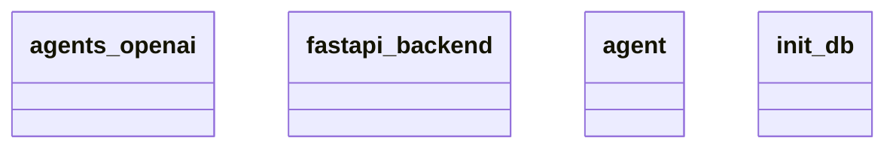

# Architecture Documentation

## Component/Module Design

The architecture of the codebase includes the following modules:

1. **agents_openai**: This module likely interacts with OpenAI's services or APIs, facilitating communication and operations that utilize OpenAI’s artificial intelligence capabilities.

2. **fastapi_backend**: This module serves as the backend component built on FastAPI, a modern web framework for building APIs with Python. It likely handles routing, server logic, and interfaces between front-end requests and back-end processes.

3. **agent**: This component could represent individual agents or entities within the system that perform specific tasks or make requests to the OpenAI services.

4. **init_db**: This module seems responsible for initializing and configuring the database that stores data for the application. It probably handles connections, migrations, and setup procedures necessary for database management.

## Relationships and Interactions

The relationships between these modules can be summarized as follows:

- The **fastapi_backend** likely serves as the central hub, coordinating actions between the **agents_openai**, **agent**, and **init_db** modules. 
- The **agent** module might invoke services provided by **agents_openai**, sending requests for AI responses or tasks. 
- The **init_db** module is essential for setting up the infrastructure, ensuring that the necessary data is accessible for the operations carried out by **fastapi_backend** and **agent**.

The interactions between these components are structured around requests and responses, with the backend acting as the primary communication pathway.

## Mermaid Diagram

Below is the generated Mermaid class diagram representing the architecture of the system:

In this diagram, the classes are shown without explicit relationships, which leaves some aspects of their interactions unspecified. However, we can observe that all components exist at a similar structural level, indicating they may work together cohesively within the architecture while performing distinct roles. The exact nature of their relationships, such as inheritance or aggregation, is not detailed, so specific dependencies or usages between them can't be conclusively determined.