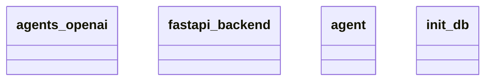

## Component/Module Design

The provided Mermaid diagram outlines four primary components of the architecture: `agents_openai`, `fastapi_backend`, `agent`, and `init_db`. 

1. **agents_openai**: This module is likely responsible for interfacing with OpenAI's API, handling requests and responses between the application and OpenAI's services. It likely encapsulates the logic needed to utilize OpenAI's capabilities within the system.

2. **fastapi_backend**: This serves as the backend framework for the application, built using FastAPI. It is expected to handle HTTP requests, manage routing, and serve as the middle layer between the client side and the business logic or data storage.

3. **agent**: The `agent` module appears to handle the specific agent-related functionality within the system. This could include the logic for executing tasks, managing state, or interacting with other components to fulfill requests.

4. **init_db**: This module likely deals with the database initialization and setup processes. It is responsible for ensuring that the database is correctly configured and ready for use by the backend components.

## Module Relationships and Interactions

The relationships and interactions between these components are not explicitly detailed in the diagram, but we can infer some potential interactions:

- **fastapi_backend** is likely the main entry point for client requests. It interacts with both the `agents_openai` and `agent` modules to process requests and generate appropriate responses.

- The **agent** may use the **agents_openai** module to perform tasks that require OpenAI's API, meaning there is a dependency on the `agents_openai` from within the `agent`.

- **init_db** is probably utilized by **fastapi_backend** during the application startup to ensure that the database is ready for any data operations that might occur during the processing of incoming requests.

## Conclusion

The architecture suggests a modular design where each component has a defined responsibility, enabling separation of concerns. However, the exact relationships and data flows between these modules are not specified in the diagram, so further details would be necessary to understand how they interact thoroughly. 

