# Architecture Overview

This documentation outlines the architecture for a FastAPI-based application that serves as a backend to facilitate various study-related activities. The architecture employs a straightforward microservices approach, allowing for modular design and flexible interactions between different components.

## System Architecture Diagram

```mermaid
flowchart TD
    fastapi_backend --> agents_openai
    agent -.->|external| metadata
    agent -.->|external| mode
    agent -.->|external| topic_id
    fastapi_backend -.->|external| _api_connection_details
    fastapi_backend -.->|external| _api_create_topic
    fastapi_backend -.->|external| _api_current_session
    fastapi_backend -.->|external| _api_current_topic
    fastapi_backend -.->|external| _api_give_more_info
    fastapi_backend -.->|external| _api_improvement_areas
    fastapi_backend -.->|external| _api_next_up_topics
    fastapi_backend -.->|external| _api_study_goals
    fastapi_backend -.->|external| _api_study_metrics
    fastapi_backend -.->|external| _api_study_planner
    fastapi_backend -.->|external| _api_study_sessions
    fastapi_backend -.->|external| _api_topic_progress
    fastapi_backend -.->|external| _api_topics
    fastapi_backend -.->|external| _api_upload_study_material
    fastapi_backend -.->|external| http___localhost_3000
    fastapi_backend -.->|external| lesson_id
    fastapi_backend -.->|external| metadata
    fastapi_backend -.->|external| mode
    fastapi_backend -.->|external| session_id
    fastapi_backend -.->|external| topic_id
```

The following diagram illustrates the main components of the system and their interactions:

### Components Explained
- **fastapi_backend**: The primary backend service built using FastAPI. It handles incoming requests for study session management, topics, and associated resources.
- **agents_openai**: A service that likely interacts with OpenAI's API to facilitate advanced features such as natural language processing or intelligent responses.
- **external components**: Various endpoints (such as `_api_create_topic`, `_api_upload_study_material`, etc.) that the FastAPI service interacts with to manage the application's functionality. Each of these components is responsible for specific API interactions related to study management.

## Technology Stack

- **FastAPI**: A modern web framework for building APIs with Python, known for its speed and automatic generation of OpenAPI documentation.
- **OpenAI API**: Used for AI-driven features, suggesting that the application may include machine learning or NLP functionalities.
- **PostgreSQL/MySQL (if applicable)**: Common backend databases for storing session and topic data, though specific DB technology is not mentioned in the provided diagram.
- **Docker (if applicable)**: If applicable, for containerization of the API and services; though not explicitly defined, modern architectures typically utilize Docker.

## Component Architecture

The system is composed of a few essential modules:
1. **FastAPI Backend**: Responsible for:
   - Handling authentication and authorization (not detailed in the codebase but typically expected).
   - Providing RESTful endpoints for the front-end.
   - Managing communication with the OpenAI agents.
   - Processing user data for study sessions, topics, and evaluations.
   
2. **OpenAI Agents**: Designed to process user queries and provide data-driven insights for topics and lessons based on natural language understanding.
   
3. **External APIs**: The various endpoints that the FastAPI backend interacts with (e.g., for creating topics, uploading materials, etc.).

## Data Architecture

The codebase does not explicitly describe the data storage solutions or database schemas utilized, but it is typical to find:
- **Relational databases** (like PostgreSQL or MySQL) for structured data like user sessions and topics.
- **NoSQL databases** (like MongoDB) might also be used if the application requires flexibility in data structure.

## API Architecture

The application exposes multiple RESTful API endpoints, as depicted in the architecture diagram. The naming conventions suggest CRUD operations with endpoints like:
- `/api/create_topic`
- `/api/study_sessions`
- `/api/upload_study_material`
These would typically employ standard HTTP methods (GET, POST, PUT, DELETE) to manage resources effectively.

## Security Architecture

While no explicit security mechanisms were detailed in the provided architecture, general security considerations for FastAPI applications include:
- **OAuth2 or JWT** for authenticating users.
- HTTPS for secure data transmission.
- Input validation and sanitation to prevent SQL injection and other attacks.

## Deployment Architecture

There is no explicit deployment architecture mentioned, but a modern deployment might include:
- **Docker** containers for encapsulating the FastAPI application.
- **Kubernetes** or **Docker Compose** for orchestrating the deployment of multiple services.
- Deployment on cloud platforms (AWS, GCP, Azure) for flexibility and scalability.

## Architectural Patterns

The application follows a **microservices architecture**. This pattern enables separation of concerns by splitting functionalities into independent components, allowing for easier maintenance, testing, and scalability.

## Key Design Decisions

Notable architectural decisions include:
1. The choice of FastAPI for its high performance and ease of use for RESTful APIs.
2. Leveraging OpenAI’s API integration for enhancing user interaction and enriching study sessions outside traditional methods.
3. Clear modularity, allowing independent deployment and scaling of backend services. 

This documentation provides a structured overview of the architecture based on the existing codebase while adhering to best practices. Further documentation may elaborate on specific modules and components as required.