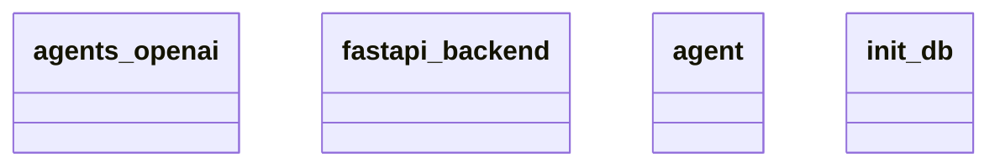

# Architecture Documentation

## Component/Module Design

The current design is composed of four main components/modules:

1. **agents_openai**: This module likely interfaces with OpenAI's APIs or models, handling interactions with the AI functionalities provided by OpenAI. It may handle tasks such as sending prompts, receiving responses, and managing the OpenAI agent's lifecycle.

2. **fastapi_backend**: This module is responsible for serving the application's backend using the FastAPI framework. It likely handles incoming requests, routes them to the appropriate handlers, and manages the communication between the frontend/client and the other backend modules.

3. **agent**: This module appears to represent a specific agent or the logic related to agent behavior in the application. It may include the core functionalities and methods that define how an agent operates within the system. This could involve decision-making processes or response generation logic.

4. **init_db**: This module is responsible for initializing and setting up the database. It likely contains functions for connecting to the database, creating tables, and executing any necessary setup commands to prepare the database for use by the application.

## Module Relationships and Interactions

Based on the provided context, we can summarize the following interactions and relationships among the modules:

- **fastapi_backend** acts as the central hub for incoming and outgoing communication. It is expected to call methods from the **agents_openai** module to process AI-related requests and from the **agent** module for handling specific agent behaviors in response to user inputs.
  
- The **init_db** module may initially be invoked during the startup of the application, ensuring that the database is ready for use by the **fastapi_backend**. This means that before any requests are handled, the database needs to be properly set up.

- **agents_openai** and **agent** may interact directly, with the **agent** possibly utilizing functionalities from **agents_openai** to augment its capabilities or provide responses based on the AI's output.

## Mermaid Class Diagram

This diagram visualizes the four key components mentioned earlier. It highlights the different modules that make up the system architecture but does not specify interaction lines or details of how they are interconnected beyond their existence. The specifics of their interactions, such as method calls or data flows, are not depicted in this diagram.