# Architecture Overview
The system architecture consists of a FastAPI backend that interacts with various external agents and APIs for managing study sessions and topics. This architecture allows for modular interaction between different components, enabling a flexible infrastructure for a study management application.

## System Architecture Diagram

```mermaid
flowchart TD
    fastapi_backend --> agents_openai
    agent -.->|external| metadata
    agent -.->|external| mode
    agent -.->|external| topic_id
    fastapi_backend -.->|external| _api_connection_details
    fastapi_backend -.->|external| _api_create_topic
    fastapi_backend -.->|external| _api_current_session
    fastapi_backend -.->|external| _api_current_topic
    fastapi_backend -.->|external| _api_give_more_info
    fastapi_backend -.->|external| _api_improvement_areas
    fastapi_backend -.->|external| _api_next_up_topics
    fastapi_backend -.->|external| _api_study_goals
    fastapi_backend -.->|external| _api_study_metrics
    fastapi_backend -.->|external| _api_study_planner
    fastapi_backend -.->|external| _api_study_sessions
    fastapi_backend -.->|external| _api_topic_progress
    fastapi_backend -.->|external| _api_topics
    fastapi_backend -.->|external| _api_upload_study_material
    fastapi_backend -.->|external| http___localhost_3000
    fastapi_backend -.->|external| lesson_id
    fastapi_backend -.->|external| metadata
    fastapi_backend -.->|external| mode
    fastapi_backend -.->|external| session_id
    fastapi_backend -.->|external| topic_id
```

Below is the generated architecture diagram representing the system components and their interconnections:

### Component Explanation
- **FastAPI Backend**: The central component responsible for handling incoming requests, processing data, and communicating with other agents and APIs.
- **Agents OpenAI**: A specialized external agent that likely interacts with OpenAI APIs to compute functionalities (e.g., topic suggestions, lesson assistance).
- **External APIs**: A series of API endpoints (like `_api_create_topic`, `_api_current_session`, etc.) that provide the functionality for managing various aspects of study sessions, topics, and user data.

## Technology Stack
- **FastAPI**: A modern web framework for building APIs with Python, known for its speed and efficiency.
- **OpenAI APIs**: Used for leveraging AI capabilities in handling user requests and providing study material enhancements.

## Component Architecture
### Main Components
1. **FastAPI Backend**
   - **Responsibilities**: Manages HTTP requests, processes user input, interacts with external APIs, and serves data to clients.
   - **Interactions**: Communicates with agents, handles endpoint requests, and provides data to clients.

2. **Agents**
   - **Responsibilities**: Executing business logic, working with external data (like fetching metadata or assisting in creating study topics).
   - **Interactions**: Interacts directly with the backend to provide services upon request.

3. **External APIs**
   - **Responsibilities**: Expose functionalities for session management, topic creation, improvement areas, and study metrics.
   - **Interactions**: All interactions with these endpoints are external, meaning they are called by the FastAPI backend.

## Data Architecture
The data flow appears to involve interactions with persistent storage managed by the FastAPI backend, although the specific database technologies and schemas were not explicitly detailed in the codebase analysis.

## API Architecture
### API Endpoints
- **_api_create_topic**: Endpoint for creating a new study topic.
- **_api_current_session**: Retrieves current session data for users.
- **_api_next_up_topics**: Provides suggestions for the next topics to study.
- Further endpoints manage functionalities related to user progress, goals, and study materials.

## Security Architecture
The documentation does not provide explicit details on security measures such as authentication and authorization. FastAPI supports OAuth2 and other security mechanisms, but specific implementations were not observed.

## Deployment Architecture
There are no explicit deployment details found in the codebase analysis. Typically, FastAPI applications may utilize Docker for containerization or be deployed on services like AWS, Azure, or GCP, but would require additional context to identify specifics.

## Architectural Patterns
- **Microservices Architecture**: The separation of concerns into different services/components (backend, agents) suggests a microservices approach, allowing for independent scaling and deployment of each part of the system.
- **RESTful API**: The use of REST conventions through various API endpoints reflects a standard RESTful architecture that simplifies interactions with the backend.

## Key Design Decisions
- **Choosing FastAPI**: The decision to use FastAPI indicates a focus on performance and ease of use, suitable for building APIs quickly.
- **Agent-based Interaction**: Implementing agents for external interactions simplifies the application structure by offloading specific responsibilities.

This documentation encompasses the essential components and interactions observed in the codebase while adhering to standard architectural documentation practices.