# Architecture Overview
The system is designed with a FastAPI backend that interacts with various external components and APIs. It focuses on educational functionalities like topic creation, study session management, and study material uploads, utilizing an agent system for enhancing interactivity with external metadata.

## System Architecture Diagram

```mermaid
flowchart TD
    fastapi_backend --> agents_openai
    agent -.->|external| metadata
    agent -.->|external| mode
    agent -.->|external| topic_id
    fastapi_backend -.->|external| _api_connection_details
    fastapi_backend -.->|external| _api_create_topic
    fastapi_backend -.->|external| _api_current_session
    fastapi_backend -.->|external| _api_current_topic
    fastapi_backend -.->|external| _api_give_more_info
    fastapi_backend -.->|external| _api_improvement_areas
    fastapi_backend -.->|external| _api_next_up_topics
    fastapi_backend -.->|external| _api_study_goals
    fastapi_backend -.->|external| _api_study_metrics
    fastapi_backend -.->|external| _api_study_planner
    fastapi_backend -.->|external| _api_study_sessions
    fastapi_backend -.->|external| _api_topic_progress
    fastapi_backend -.->|external| _api_topics
    fastapi_backend -.->|external| _api_upload_study_material
    fastapi_backend -.->|external| http___localhost_3000
    fastapi_backend -.->|external| lesson_id
    fastapi_backend -.->|external| metadata
    fastapi_backend -.->|external| mode
    fastapi_backend -.->|external| session_id
    fastapi_backend -.->|external| topic_id
```

### Component Explanation:
- **FastAPI Backend**: The core of the system, it handles incoming requests and manages interactions with external agents and APIs.
- **Agents (OpenAI)**: These are specialized components, likely using OpenAI APIs, to perform actions based on user queries and provide intelligent responses.
- **External API Endpoints**: Multiple endpoints, such as `_api_create_topic`, `_api_current_session`, and others, are defined for interacting with external data sources and services.

## Technology Stack
- **FastAPI**: A modern web framework for building APIs with Python, focusing on speed and efficiency.
- **OpenAI API**: Used for generating responses or handling more complex requests.
- **Asyncio**: Concurrency library for Python, allowing for asynchronous network calls.
  
## Component Architecture
1. **FastAPI Backend**:
   - **Responsibilities**: Handle requests, route to external APIs, manage business logic.
   - **Interactions**: Communicates with agent systems and both internal and external APIs.
  
2. **Agent System**:
   - **Responsibilities**: Manage interactions with external data and compute based on the context provided by the user.
   - **Interactions**: Pulls metadata and context-specific data through API calls.

## Data Architecture
Information on data storage solutions, such as databases, schemas, or specific storage technologies, was not provided in the initial analysis and will need further investigation.

## API Architecture
The FastAPI framework implies a RESTful approach, with multiple API endpoints:
- **_api_create_topic**: Create topics in the system.
- **_api_current_session**: Retrieve session details.
- **_api_study_goals**: Fetch study goal information, etc.

## Security Architecture
No specific security measures, authentication, or authorization patterns were found based on the analysis. Further inspection of the codebase may be needed to provide insights into security features.

## Deployment Architecture
Information about the deployment architecture, including any containerization or cloud service configurations, exists but was not detailed in the provided analysis. Additional details about deployment should be reviewed in the codebase documentation or comments.

## Architectural Patterns
The system utilizes a layered architecture with a clear separation between the FastAPI backend and external services. This allows for flexible integration with third-party APIs and components.

## Key Design Decisions
- **Use of FastAPI**: Indicates a focus on performance and rapid development capabilities, enhancing asynchronous processing.
- **Integration with OpenAI**: Suggests an emphasis on advanced capabilities for user interactions, leveraging AI capabilities for improved responsiveness.