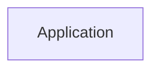

# Architecture Overview

The architecture of this software project is primarily structured around a microservices approach leveraging FastAPI for the backend. It consists of several API endpoints designed to handle various functionalities related to study management, including topics, study sessions, goals, metrics, and materials. The architecture diagram visually represents these components, although further details on frontend technologies were not provided.

## System Architecture Diagram

- **Application:** Represents the main application component, acting as an entry point for services handling user requests.

## Technology Stack

- **Backend Framework:** FastAPI
  - Purpose: To create and manage RESTful APIs efficiently.
- **Configuration:** Environment variables managed through a `.env` file as indicated in `best-in-class-ai/.env.example`.
- **Version Control:** The codebase appears to follow a custom structure without clear separation of components.
  
### Additional Observations:
- There is a lack of specific database technologies and tools mentioned in the codebase analysis.

## Component Architecture

### Main Components (API Endpoints):
1. **/api/give-more-info** (POST) - Provides additional information based on user requests.
2. **/api/upload-study-material** (POST) - Endpoint to upload study materials.
3. **/api/create-topic** (POST) - Used for creating new study topics.
4. **/api/study-planner** (POST) - Manages study planning activities.
5. **/api/study-sessions** (GET) - Retrieves study session data.
6. **/api/topics** (GET) - Fetches existing study topics.
7. **/api/current-topic** (GET) - Gets information about the current topic.
8. **/api/topic-progress** (GET) - Returns progress data for study topics.
9. **/api/next-up-topics** (GET) - Provides a list of upcoming topics for study.
10. **/api/study-goals** (GET, POST) - Endpoints for managing user study goals.
11. **/api/improvement-areas** (GET, POST) - Endpoints to identify areas for improvement in the study plan.
12. **/api/study-metrics** (GET) - Fetches metrics related to study sessions and performance.
13. **/api/current-session** (GET, POST) - Endpoint to manage the current study session.

## Data Architecture

The current analysis does not indicate any specific data storage solution or database schema used within the application. It appears focused primarily on API endpoints and does not provide information on data flow patterns or underlying data management technologies.

## API Architecture

The API adopts common REST conventions and provides multiple endpoints for various functionalities, as detailed in the component architecture section. There is currently no indication of API authentication or versioning mechanisms in use.

## Security Architecture

No explicit security measures, authentication, or authorization patterns were identified in the codebase analysis. Further investigation into the FastAPI implementation may be necessary to determine any security considerations.

## Deployment Architecture

The deployment architecture is not explicitly outlined in the codebase. There are no indications of containerization, CI/CD processes, or cloud services configured. 

## Architectural Patterns

No clear architectural patterns (e.g., MVC, microservices) are identifiable based on the provided analysis. The structure is described as a "Custom Structure" without defined separation of concerns.

## Key Design Decisions

- The choice to use FastAPI likely reflects a preference for high performance and ease of creating RESTful APIs.
- The codebase structure indicates a potential need for organizational improvement, particularly in the separation of concerns and clear component definitions.

---

This documentation encompasses the available information derived from the codebase based on the analytical tools used. It serves as a foundational reference for understanding the architecture of the project. Further exploration may yield additional insights, especially in areas like data persistence and deployment strategies.