```mermaid
flowchart TD
    fastapi_backend --> agents_openai
    agent -.->|external| metadata
    agent -.->|external| mode
    agent -.->|external| topic_id
    fastapi_backend -.->|external| _api_connection_details
    fastapi_backend -.->|external| _api_create_topic
    fastapi_backend -.->|external| _api_current_session
    fastapi_backend -.->|external| _api_current_topic
    fastapi_backend -.->|external| _api_give_more_info
    fastapi_backend -.->|external| _api_improvement_areas
    fastapi_backend -.->|external| _api_next_up_topics
    fastapi_backend -.->|external| _api_study_goals
    fastapi_backend -.->|external| _api_study_metrics
    fastapi_backend -.->|external| _api_study_planner
    fastapi_backend -.->|external| _api_study_sessions
    fastapi_backend -.->|external| _api_topic_progress
    fastapi_backend -.->|external| _api_topics
    fastapi_backend -.->|external| _api_upload_study_material
    fastapi_backend -.->|external| http___localhost_3000
    fastapi_backend -.->|external| lesson_id
    fastapi_backend -.->|external| metadata
    fastapi_backend -.->|external| mode
    fastapi_backend -.->|external| session_id
    fastapi_backend -.->|external| topic_id
```

## Information Flows Description

The application consists of a backend service, presumably implemented using FastAPI, that interacts with an external system (possibly OpenAI agents) and various metadata and API endpoints. Below is a breakdown of the actual information/data flows present in the system.

### Flow Descriptions

1. **Flow from FastAPI Backend to OpenAI Agents**
   - **Source:** fastapi_backend
   - **Destination:** agents_openai
   - **Data Type:** Unknown (actual data not specified)
   - **Purpose:** To send information or requests to the OpenAI agents for processing.

2. **Flow from Agent to Metadata**
   - **Source:** agent
   - **Destination:** metadata
   - **Data Type:** Unknown (actual data not specified)
   - **Purpose:** To send metadata information as part of the operation, possibly for configuration or context.

3. **Flow from Agent to Mode**
   - **Source:** agent
   - **Destination:** mode
   - **Data Type:** Unknown (actual data not specified)
   - **Purpose:** To send information regarding the operational mode of the agent.

4. **Flow from Agent to Topic ID**
   - **Source:** agent
   - **Destination:** topic_id
   - **Data Type:** Unknown (actual data not specified)
   - **Purpose:** To transmit the identifier for the current topic.

5. **Flow from FastAPI Backend to Various API Endpoints**
   - **Source:** fastapi_backend
   - **Destination:** _api_connection_details
   - **Data Type:** Unknown (actual data not specified)
   - **Purpose:** To provide details necessary for establishing a connection with an external API.

6. **Flow from FastAPI Backend to Create Topic API**
   - **Source:** fastapi_backend
   - **Destination:** _api_create_topic
   - **Data Type:** Unknown (actual data not specified)
   - **Purpose:** To create a new topic in the external system.

7. **Flow from FastAPI Backend to Current Session API**
   - **Source:** fastapi_backend
   - **Destination:** _api_current_session
   - **Data Type:** Unknown (actual data not specified)
   - **Purpose:** To retrieve details about the current session in the external system.

8. **Flow from FastAPI Backend to Current Topic API**
   - **Source:** fastapi_backend
   - **Destination:** _api_current_topic
   - **Data Type:** Unknown (actual data not specified)
   - **Purpose:** To access data regarding the current topic within the session.

9. **Flow from FastAPI Backend to Various Other API Endpoints**
   - Multiple flows to various endpoints like:
      - _api_give_more_info
      - _api_improvement_areas
      - _api_next_up_topics
      - _api_study_goals
      - _api_study_metrics
      - _api_study_planner
      - _api_study_sessions
      - _api_topic_progress
      - _api_topics
      - _api_upload_study_material
   - **Source:** fastapi_backend
   - **Destination:** Each respective API endpoint
   - **Data Type:** Unknown (actual data not specified)
   - **Purpose:** Each flow serves the purpose of interacting with the respective functionalities provided by the API.

10. **Flow from FastAPI Backend to Localhost**
    - **Source:** fastapi_backend
    - **Destination:** http___localhost_3000
    - **Data Type:** Unknown (actual data not specified)
    - **Purpose:** To communicate with a local service, potentially for development or testing.

11. **Flow from FastAPI Backend to Lesson ID**
    - **Source:** fastapi_backend
    - **Destination:** lesson_id
    - **Data Type:** Unknown (actual data not specified)
    - **Purpose:** To send the identifier for the current lesson being processed.

12. **Flow from FastAPI Backend to Session ID**
    - **Source:** fastapi_backend
    - **Destination:** session_id
    - **Data Type:** Unknown (actual data not specified)
    - **Purpose:** To send the identifier for the current session being processed.

### Mermaid Flowchart

