```mermaid
flowchart TD
    fastapi_backend --> agents_openai
    agent -.->|external| metadata
    agent -.->|external| mode
    agent -.->|external| topic_id
    fastapi_backend -.->|external| _api_connection_details
    fastapi_backend -.->|external| _api_create_topic
    fastapi_backend -.->|external| _api_current_session
    fastapi_backend -.->|external| _api_current_topic
    fastapi_backend -.->|external| _api_give_more_info
    fastapi_backend -.->|external| _api_improvement_areas
    fastapi_backend -.->|external| _api_next_up_topics
    fastapi_backend -.->|external| _api_study_goals
    fastapi_backend -.->|external| _api_study_metrics
    fastapi_backend -.->|external| _api_study_planner
    fastapi_backend -.->|external| _api_study_sessions
    fastapi_backend -.->|external| _api_topic_progress
    fastapi_backend -.->|external| _api_topics
    fastapi_backend -.->|external| _api_upload_study_material
    fastapi_backend -.->|external| http___localhost_3000
    fastapi_backend -.->|external| lesson_id
    fastapi_backend -.->|external| metadata
    fastapi_backend -.->|external| mode
    fastapi_backend -.->|external| session_id
    fastapi_backend -.->|external| topic_id
```

# Information Flows Overview
This document outlines the information flows within the application, detailing the interactions between internal components and external systems.

## Information Flows

1. **Flow from FastAPI Backend to OpenAI Agents**
   - **Source:** fastapi_backend
   - **Destination:** agents_openai
   - **Data Type:** Unknown (possibly API requests/responses)
   - **Purpose:** To facilitate interaction with OpenAI agents.

2. **Flow from Agent to Metadata (External)**
   - **Source:** agent
   - **Destination:** metadata
   - **Data Type:** Unknown
   - **Purpose:** Unknown (external interaction).

3. **Flow from Agent to Mode (External)**
   - **Source:** agent
   - **Destination:** mode
   - **Data Type:** Unknown
   - **Purpose:** Unknown (external interaction).

4. **Flow from Agent to Topic ID (External)**
   - **Source:** agent
   - **Destination:** topic_id
   - **Data Type:** Unknown
   - **Purpose:** Unknown (external interaction).

5. **Various Flows from FastAPI Backend to External APIs**
   - **Source:** fastapi_backend
   - **Destination:** Various external APIs (e.g., _api_connection_details, _api_create_topic, _api_current_session, etc.)
   - **Data Type:** Unknown
   - **Purpose:** Each flow relates to different operational aspects of the application, such as creating topics, managing study sessions, and retrieving progress metrics.

6. **Flow to localhost**
   - **Source:** fastapi_backend
   - **Destination:** http://localhost:3000
   - **Data Type:** Unknown
   - **Purpose:** Unknown (likely for local development or testing).

7. **Additional External Flows from FastAPI Backend**
   - **Source:** fastapi_backend
   - **Destination:** metadata, mode, lesson_id, session_id, topic_id
   - **Data Type:** Unknown
   - **Purpose:** Unknown (external interactions).

*Note: Many of the exact data types and purposes are marked as unknown due to the lack of specific context.*

