```mermaid
flowchart TD
    fastapi_backend --> agents_openai
    agent -.->|external| metadata
    agent -.->|external| mode
    agent -.->|external| topic_id
    fastapi_backend -.->|external| _api_connection_details
    fastapi_backend -.->|external| _api_create_topic
    fastapi_backend -.->|external| _api_current_session
    fastapi_backend -.->|external| _api_current_topic
    fastapi_backend -.->|external| _api_give_more_info
    fastapi_backend -.->|external| _api_improvement_areas
    fastapi_backend -.->|external| _api_next_up_topics
    fastapi_backend -.->|external| _api_study_goals
    fastapi_backend -.->|external| _api_study_metrics
    fastapi_backend -.->|external| _api_study_planner
    fastapi_backend -.->|external| _api_study_sessions
    fastapi_backend -.->|external| _api_topic_progress
    fastapi_backend -.->|external| _api_topics
    fastapi_backend -.->|external| _api_upload_study_material
    fastapi_backend -.->|external| http___localhost_3000
    fastapi_backend -.->|external| lesson_id
    fastapi_backend -.->|external| metadata
    fastapi_backend -.->|external| mode
    fastapi_backend -.->|external| session_id
    fastapi_backend -.->|external| topic_id
```

# Information Flows Overview
This document outlines the information flows within the application, detailing the interactions between the backend and external systems, including APIs and data components relevant to specific functions.

## Information Flows

1. **Flow from fastapi_backend to agents_openai**
   - **Source:** fastapi_backend
   - **Destination:** agents_openai
   - **Data Type:** Unknown
   - **Purpose:** To potentially engage or utilize OpenAI agents in processing or generating content.

2. **Flow from agent to external metadata**
   - **Source:** agent
   - **Destination:** metadata
   - **Data Type:** Unknown
   - **Purpose:** To provide metadata information used for processing within the application.

3. **Flow from agent to external mode**
   - **Source:** agent
   - **Destination:** mode
   - **Data Type:** Unknown
   - **Purpose:** To communicate the current operational mode of the agent.

4. **Flow from agent to external topic_id**
   - **Source:** agent
   - **Destination:** topic_id
   - **Data Type:** Unknown
   - **Purpose:** To specify or refer to a particular topic in processing.

5. **Flow from fastapi_backend to external _api_connection_details**
   - **Source:** fastapi_backend
   - **Destination:** _api_connection_details
   - **Data Type:** Connection details
   - **Purpose:** To establish or maintain a connection to an external API.

6. **Flow from fastapi_backend to external _api_create_topic**
   - **Source:** fastapi_backend
   - **Destination:** _api_create_topic
   - **Data Type:** API for creating a topic
   - **Purpose:** To initiate the creation of a new topic in the external system.

7. **Flow from fastapi_backend to external _api_current_session**
   - **Source:** fastapi_backend
   - **Destination:** _api_current_session
   - **Data Type:** Session details
   - **Purpose:** To retrieve the current session information.

8. **Flow from fastapi_backend to external _api_current_topic**
   - **Source:** fastapi_backend
   - **Destination:** _api_current_topic
   - **Data Type:** Topic details
   - **Purpose:** To obtain information about the current topic.

9. **Flow from fastapi_backend to external _api_give_more_info**
   - **Source:** fastapi_backend
   - **Destination:** _api_give_more_info
   - **Data Type:** Instruction or data for additional information
   - **Purpose:** To request or provide further information on a subject.

10. **Flow from fastapi_backend to external _api_improvement_areas**
    - **Source:** fastapi_backend
    - **Destination:** _api_improvement_areas
    - **Data Type:** Improvement areas data
    - **Purpose:** To provide or receive data related to improvement areas.

11. **Flow from fastapi_backend to external _api_next_up_topics**
    - **Source:** fastapi_backend
    - **Destination:** _api_next_up_topics
    - **Data Type:** Topics data
    - **Purpose:** To retrieve upcoming topics for consideration.

12. **Flow from fastapi_backend to external _api_study_goals**
    - **Source:** fastapi_backend
    - **Destination:** _api_study_goals
    - **Data Type:** Study goals data
    - **Purpose:** To communicate or fetch study goals.

13. **Flow from fastapi_backend to external _api_study_metrics**
    - **Source:** fastapi_backend
    - **Destination:** _api_study_metrics
    - **Data Type:** Study metrics data
    - **Purpose:** To access or report metrics related to study activities.

14. **Flow from fastapi_backend to external _api_study_planner**
    - **Source:** fastapi_backend
    - **Destination:** _api_study_planner
    - **Data Type:** Study planner data
    - **Purpose:** To interact with the study planner API to manage study sessions.

15. **Flow from fastapi_backend to external _api_study_sessions**
    - **Source:** fastapi_backend
    - **Destination:** _api_study_sessions
    - **Data Type:** Study session data
    - **Purpose:** To manage or retrieve data related to study sessions.

16. **Flow from fastapi_backend to external _api_topic_progress**
    - **Source:** fastapi_backend
    - **Destination:** _api_topic_progress
    - **Data Type:** Progress data on topics
    - **Purpose:** To report or retrieve the progress on specific topics.

17. **Flow from fastapi_backend to external _api_topics**
    - **Source:** fastapi_backend
    - **Destination:** _api_topics
    - **Data Type:** Topics data
    - **Purpose:** To retrieve or manage topics within the external system.

18. **Flow from fastapi_backend to external _api_upload_study_material**
    - **Source:** fastapi_backend
    - **Destination:** _api_upload_study_material
    - **Data Type:** Study material data
    - **Purpose:** To upload relevant study materials to the external service.

19. **Flow from fastapi_backend to external http___localhost_3000**
    - **Source:** fastapi_backend
    - **Destination:** http___localhost_3000
    - **Data Type:** HTTP request
    - **Purpose:** To make a request to a local service or endpoint.

20. **Flow from fastapi_backend to external lesson_id**
    - **Source:** fastapi_backend
    - **Destination:** lesson_id
    - **Data Type:** Lesson identifier
    - **Purpose:** To specify or reference a particular lesson within the application.

21. **Flow from fastapi_backend to external metadata**
    - **Source:** fastapi_backend
    - **Destination:** metadata
    - **Data Type:** Metadata information
    - **Purpose:** To provide or receive metadata for various processes.

22. **Flow from fastapi_backend to external mode**
    - **Source:** fastapi_backend
    - **Destination:** mode
    - **Data Type:** Mode information
    - **Purpose:** To communicate operational mode settings to external systems.

23. **Flow from fastapi_backend to external session_id**
    - **Source:** fastapi_backend
    - **Destination:** session_id
    - **Data Type:** Session identifier
    - **Purpose:** To reference a specific session in processing.

24. **Flow from fastapi_backend to external topic_id**
    - **Source:** fastapi_backend
    - **Destination:** topic_id
    - **Data Type:** Topic identifier
    - **Purpose:** To refer to or specify topics handled by the backend.

