```mermaid
flowchart TD
    fastapi_backend --> agents_openai
    agent -.->|external| metadata
    agent -.->|external| mode
    agent -.->|external| topic_id
    fastapi_backend -.->|external| _api_connection_details
    fastapi_backend -.->|external| _api_create_topic
    fastapi_backend -.->|external| _api_current_session
    fastapi_backend -.->|external| _api_current_topic
    fastapi_backend -.->|external| _api_give_more_info
    fastapi_backend -.->|external| _api_improvement_areas
    fastapi_backend -.->|external| _api_next_up_topics
    fastapi_backend -.->|external| _api_study_goals
    fastapi_backend -.->|external| _api_study_metrics
    fastapi_backend -.->|external| _api_study_planner
    fastapi_backend -.->|external| _api_study_sessions
    fastapi_backend -.->|external| _api_topic_progress
    fastapi_backend -.->|external| _api_topics
    fastapi_backend -.->|external| _api_upload_study_material
    fastapi_backend -.->|external| http___localhost_3000
    fastapi_backend -.->|external| lesson_id
    fastapi_backend -.->|external| metadata
    fastapi_backend -.->|external| mode
    fastapi_backend -.->|external| session_id
    fastapi_backend -.->|external| topic_id
```

# Information Flows Overview
This document describes the information flows within the application and its interactions with external systems. The flows involve a FastAPI backend and several external endpoints and variables.

## Information Flows

1. **Flow from FastAPI Backend to Agents OpenAI**
   - **Source:** FastAPI Backend
   - **Destination:** Agents OpenAI
   - **Data Type:** Not explicitly identified (may include user inputs or instructions)
   - **Purpose:** To process requests or data related to the agents.

2. **Flow from Agent to External Variables (Multiple)**
   - **Source:** Agent
   - **Destination:** Various external identifiers (metadata, mode, topic_id)
   - **Data Type:** Not explicitly identified
   - **Purpose:** To communicate configuration or context data for processing with external systems.

3. **Flow from FastAPI Backend to External API Endpoints (Multiple)**
   - **Source:** FastAPI Backend
   - **Destination:** Various external API endpoints (_api_connection_details, _api_create_topic, _api_current_session, etc.)
   - **Data Type:** Not explicitly identified
   - **Purpose:** To facilitate various functionalities such as creating topics, fetching session details, or managing study materials through external APIs.

4. **Flow from FastAPI Backend to Localhost**
   - **Source:** FastAPI Backend
   - **Destination:** http://localhost:3000
   - **Data Type:** Not explicitly identified
   - **Purpose:** To interact with a local service, potentially for development or testing purposes.

5. **Flow from FastAPI Backend to External Identifiers (Multiple)**
   - **Source:** FastAPI Backend
   - **Destination:** Various external variables (lesson_id, session_id, metadata, mode, topic_id)
   - **Data Type:** Not explicitly identified
   - **Purpose:** To pass context data relevant to the ongoing processes or workflows.

