```mermaid
flowchart TD
    fastapi_backend --> agents_openai
    agent -.->|external| metadata
    agent -.->|external| mode
    agent -.->|external| topic_id
    fastapi_backend -.->|external| _api_connection_details
    fastapi_backend -.->|external| _api_create_topic
    fastapi_backend -.->|external| _api_current_session
    fastapi_backend -.->|external| _api_current_topic
    fastapi_backend -.->|external| _api_give_more_info
    fastapi_backend -.->|external| _api_improvement_areas
    fastapi_backend -.->|external| _api_next_up_topics
    fastapi_backend -.->|external| _api_study_goals
    fastapi_backend -.->|external| _api_study_metrics
    fastapi_backend -.->|external| _api_study_planner
    fastapi_backend -.->|external| _api_study_sessions
    fastapi_backend -.->|external| _api_topic_progress
    fastapi_backend -.->|external| _api_topics
    fastapi_backend -.->|external| _api_upload_study_material
    fastapi_backend -.->|external| http___localhost_3000
    fastapi_backend -.->|external| lesson_id
    fastapi_backend -.->|external| metadata
    fastapi_backend -.->|external| mode
    fastapi_backend -.->|external| session_id
    fastapi_backend -.->|external| topic_id
```

# Information Flows Overview
This document outlines the information flows within the application, detailing the exchange of data between components and external systems.

## Information Flows

1. **Flow from fastapi_backend to agents_openai**
   - **Source:** fastapi_backend
   - **Destination:** agents_openai
   - **Data Type:** Unknown (Specific data type not specified)
   - **Purpose:** Communication or processing via the agents_openai module.

2. **Flow between agent and external metadata**
   - **Source:** agent
   - **Destination:** metadata (external)
   - **Data Type:** Unknown (Specific data type not specified)
   - **Purpose:** Interaction with external metadata.

3. **Flow between agent and external mode**
   - **Source:** agent
   - **Destination:** mode (external)
   - **Data Type:** Unknown (Specific data type not specified)
   - **Purpose:** Interaction with external mode.

4. **Flow between agent and external topic_id**
   - **Source:** agent
   - **Destination:** topic_id (external)
   - **Data Type:** Unknown (Specific data type not specified)
   - **Purpose:** Interaction with external topic identifier.

5. **Flow from fastapi_backend to external _api_connection_details**
   - **Source:** fastapi_backend
   - **Destination:** _api_connection_details (external)
   - **Data Type:** Unknown (Specific data type not specified)
   - **Purpose:** Provides connection details to an external API.

6. **Flow from fastapi_backend to external _api_create_topic**
   - **Source:** fastapi_backend
   - **Destination:** _api_create_topic (external)
   - **Data Type:** Unknown (Specific data type not specified)
   - **Purpose:** Requests to create a topic via an external API.

7. **Flow from fastapi_backend to external _api_current_session**
   - **Source:** fastapi_backend
   - **Destination:** _api_current_session (external)
   - **Data Type:** Unknown (Specific data type not specified)
   - **Purpose:** Retrieves current session information from an external API.

8. **Flow from fastapi_backend to external _api_current_topic**
   - **Source:** fastapi_backend
   - **Destination:** _api_current_topic (external)
   - **Data Type:** Unknown (Specific data type not specified)
   - **Purpose:** Retrieves current topic information from an external API.

9. **Flow from fastapi_backend to external _api_give_more_info**
   - **Source:** fastapi_backend
   - **Destination:** _api_give_more_info (external)
   - **Data Type:** Unknown (Specific data type not specified)
   - **Purpose:** Requests for more information via an external API.

10. **Flow from fastapi_backend to external _api_improvement_areas**
   - **Source:** fastapi_backend
   - **Destination:** _api_improvement_areas (external)
   - **Data Type:** Unknown (Specific data type not specified)
   - **Purpose:** Accesses improvement area information from an external API.

11. **Flow from fastapi_backend to external _api_next_up_topics**
   - **Source:** fastapi_backend
   - **Destination:** _api_next_up_topics (external)
   - **Data Type:** Unknown (Specific data type not specified)
   - **Purpose:** Inquires about upcoming topics via an external API.

12. **Flow from fastapi_backend to external _api_study_goals**
   - **Source:** fastapi_backend
   - **Destination:** _api_study_goals (external)
   - **Data Type:** Unknown (Specific data type not specified)
   - **Purpose:** Retrieves study goals from an external API.

13. **Flow from fastapi_backend to external _api_study_metrics**
   - **Source:** fastapi_backend
   - **Destination:** _api_study_metrics (external)
   - **Data Type:** Unknown (Specific data type not specified)
   - **Purpose:** Accesses study metrics from an external API.

14. **Flow from fastapi_backend to external _api_study_planner**
   - **Source:** fastapi_backend
   - **Destination:** _api_study_planner (external)
   - **Data Type:** Unknown (Specific data type not specified)
   - **Purpose:** Involves interaction with a study planner API.

15. **Flow from fastapi_backend to external _api_study_sessions**
   - **Source:** fastapi_backend
   - **Destination:** _api_study_sessions (external)
   - **Data Type:** Unknown (Specific data type not specified)
   - **Purpose:** Retrieves information about study sessions from an external API.

16. **Flow from fastapi_backend to external _api_topic_progress**
   - **Source:** fastapi_backend
   - **Destination:** _api_topic_progress (external)
   - **Data Type:** Unknown (Specific data type not specified)
   - **Purpose:** Accesses topic progress data from an external API.

17. **Flow from fastapi_backend to external _api_topics**
   - **Source:** fastapi_backend
   - **Destination:** _api_topics (external)
   - **Data Type:** Unknown (Specific data type not specified)
   - **Purpose:** Requests a list of topics via an external API.

18. **Flow from fastapi_backend to external _api_upload_study_material**
   - **Source:** fastapi_backend
   - **Destination:** _api_upload_study_material (external)
   - **Data Type:** Unknown (Specific data type not specified)
   - **Purpose:** Handles uploading study material to an external API.

19. **Flow from fastapi_backend to external http___localhost_3000**
   - **Source:** fastapi_backend
   - **Destination:** http___localhost_3000 (external)
   - **Data Type:** Unknown (Specific data type not specified)
   - **Purpose:** An unspecified HTTP interaction with a local server (potentially used for testing).

20. **Flow from fastapi_backend to external lesson_id**
   - **Source:** fastapi_backend
   - **Destination:** lesson_id (external)
   - **Data Type:** Unknown (Specific data type not specified)
   - **Purpose:** Involves interaction with a lesson identifier externally.

21. **Flow from fastapi_backend to external metadata**
   - **Source:** fastapi_backend
   - **Destination:** metadata (external)
   - **Data Type:** Unknown (Specific data type not specified)
   - **Purpose:** An additional interaction with external metadata.

22. **Flow from fastapi_backend to external mode**
   - **Source:** fastapi_backend
   - **Destination:** mode (external)
   - **Data Type:** Unknown (Specific data type not specified)
   - **Purpose:** Additional interaction with external mode.

23. **Flow from fastapi_backend to external session_id**
   - **Source:** fastapi_backend
   - **Destination:** session_id (external)
   - **Data Type:** Unknown (Specific data type not specified)
   - **Purpose:** Involves interaction with an external session identifier.

24. **Flow from fastapi_backend to external topic_id**
   - **Source:** fastapi_backend
   - **Destination:** topic_id (external)
   - **Data Type:** Unknown (Specific data type not specified)
   - **Purpose:** Another interaction with an external topic identifier.

