```mermaid
flowchart TD
    fastapi_backend --> agents_openai
    agent -.->|external| metadata
    agent -.->|external| mode
    agent -.->|external| topic_id
    fastapi_backend -.->|external| _api_connection_details
    fastapi_backend -.->|external| _api_create_topic
    fastapi_backend -.->|external| _api_current_session
    fastapi_backend -.->|external| _api_current_topic
    fastapi_backend -.->|external| _api_give_more_info
    fastapi_backend -.->|external| _api_improvement_areas
    fastapi_backend -.->|external| _api_next_up_topics
    fastapi_backend -.->|external| _api_study_goals
    fastapi_backend -.->|external| _api_study_metrics
    fastapi_backend -.->|external| _api_study_planner
    fastapi_backend -.->|external| _api_study_sessions
    fastapi_backend -.->|external| _api_topic_progress
    fastapi_backend -.->|external| _api_topics
    fastapi_backend -.->|external| _api_upload_study_material
    fastapi_backend -.->|external| http___localhost_3000
    fastapi_backend -.->|external| lesson_id
    fastapi_backend -.->|external| metadata
    fastapi_backend -.->|external| mode
    fastapi_backend -.->|external| session_id
    fastapi_backend -.->|external| topic_id
```

The analysis of information flows within the application reveals several distinct interactions among modules and external systems. Below is a detailed description of each flow:

1. **FastAPI Backend to Agents (OpenAI)**
   - **Source**: `fastapi_backend`
   - **Destination**: `agents_openai`
   - **Data Type**: Unknown (assumed API requests or responses)
   - **Purpose**: To interact with the OpenAI agents for processing or retrieving information.

2. **Agent to External Metadata**
   - **Source**: `agent`
   - **Destination**: `metadata`
   - **Data Type**: Unknown
   - **Purpose**: To access metadata which could inform the agent's processing or decisions.

3. **Agent to External Mode**
   - **Source**: `agent`
   - **Destination**: `mode`
   - **Data Type**: Unknown
   - **Purpose**: To interact with or modify its operational mode.

4. **Agent to External Topic ID**
   - **Source**: `agent`
   - **Destination**: `topic_id`
   - **Data Type**: Unknown
   - **Purpose**: To access or set the current topic identifier for processing.

5. **FastAPI Backend to API Connection Details**
   - **Source**: `fastapi_backend`
   - **Destination**: `_api_connection_details`
   - **Data Type**: Unknown
   - **Purpose**: To obtain or manage connection details related to an external API.

6. **FastAPI Backend to API Create Topic**
   - **Source**: `fastapi_backend`
   - **Destination**: `_api_create_topic`
   - **Data Type**: Unknown
   - **Purpose**: To create a new topic through an external API.

7. **FastAPI Backend to API Current Session**
   - **Source**: `fastapi_backend`
   - **Destination**: `_api_current_session`
   - **Data Type**: Unknown
   - **Purpose**: To retrieve or manage the current session data from an external API.

8. **FastAPI Backend to API Current Topic**
   - **Source**: `fastapi_backend`
   - **Destination**: `_api_current_topic`
   - **Data Type**: Unknown
   - **Purpose**: To retrieve or manage the current topic data from an external API.

9. **FastAPI Backend to API Give More Info**
   - **Source**: `fastapi_backend`
   - **Destination**: `_api_give_more_info`
   - **Data Type**: Unknown
   - **Purpose**: To request more information from an external API.

10. **FastAPI Backend to API Improvement Areas**
    - **Source**: `fastapi_backend`
    - **Destination**: `_api_improvement_areas`
    - **Data Type**: Unknown
    - **Purpose**: To retrieve areas for improvement from an external API.

11. **FastAPI Backend to API Next Up Topics**
    - **Source**: `fastapi_backend`
    - **Destination**: `_api_next_up_topics`
    - **Data Type**: Unknown
    - **Purpose**: To get topics that are next on the agenda from an external API.

12. **FastAPI Backend to API Study Goals**
    - **Source**: `fastapi_backend`
    - **Destination**: `_api_study_goals`
    - **Data Type**: Unknown
    - **Purpose**: To interact with the goals set for studying via an external API.

13. **FastAPI Backend to API Study Metrics**
    - **Source**: `fastapi_backend`
    - **Destination**: `_api_study_metrics`
    - **Data Type**: Unknown
    - **Purpose**: To retrieve or set study metrics from an external API.

14. **FastAPI Backend to API Study Planner**
    - **Source**: `fastapi_backend`
    - **Destination**: `_api_study_planner`
    - **Data Type**: Unknown
    - **Purpose**: To manage study planning through an external API.

15. **FastAPI Backend to API Study Sessions**
    - **Source**: `fastapi_backend`
    - **Destination**: `_api_study_sessions`
    - **Data Type**: Unknown
    - **Purpose**: To retrieve study session data from an external API.

16. **FastAPI Backend to API Topic Progress**
    - **Source**: `fastapi_backend`
    - **Destination**: `_api_topic_progress`
    - **Data Type**: Unknown
    - **Purpose**: To check or manage progress for topics via an external API.

17. **FastAPI Backend to API Topics**
    - **Source**: `fastapi_backend`
    - **Destination**: `_api_topics`
    - **Data Type**: Unknown
    - **Purpose**: To retrieve a list of topics through an external API.

18. **FastAPI Backend to API Upload Study Material**
    - **Source**: `fastapi_backend`
    - **Destination**: `_api_upload_study_material`
    - **Data Type**: Unknown
    - **Purpose**: To upload study materials to an external API.

19. **FastAPI Backend to External Server**
    - **Source**: `fastapi_backend`
    - **Destination**: `http://localhost:3000`
    - **Data Type**: Unknown
    - **Purpose**: To send or receive data from a local server.

20. **FastAPI Backend to External Lesson ID**
    - **Source**: `fastapi_backend`
    - **Destination**: `lesson_id`
    - **Data Type**: Unknown
    - **Purpose**: To access specific lesson data.

21. **FastAPI Backend to External Metadata (duplicate)**
    - **Source**: `fastapi_backend`
    - **Destination**: `metadata`
    - **Data Type**: Unknown
    - **Purpose**: Redundant access to metadata.

22. **FastAPI Backend to External Mode (duplicate)**
    - **Source**: `fastapi_backend`
    - **Destination**: `mode`
    - **Data Type**: Unknown
    - **Purpose**: Redundant interaction with operational mode.

23. **FastAPI Backend to External Session ID**
    - **Source**: `fastapi_backend`
    - **Destination**: `session_id`
    - **Data Type**: Unknown
    - **Purpose**: To access or track specific session data.

24. **FastAPI Backend to External Topic ID (duplicate)**
    - **Source**: `fastapi_backend`
    - **Destination**: `topic_id`
    - **Data Type**: Unknown
    - **Purpose**: Redundant access to the topic identifier.

Here's the exact Mermaid diagram derived from the code analysis:

