```mermaid
flowchart TD
    fastapi_backend --> agents_openai
    agent -.->|external| metadata
    agent -.->|external| mode
    agent -.->|external| topic_id
    fastapi_backend -.->|external| _api_connection_details
    fastapi_backend -.->|external| _api_create_topic
    fastapi_backend -.->|external| _api_current_session
    fastapi_backend -.->|external| _api_current_topic
    fastapi_backend -.->|external| _api_give_more_info
    fastapi_backend -.->|external| _api_improvement_areas
    fastapi_backend -.->|external| _api_next_up_topics
    fastapi_backend -.->|external| _api_study_goals
    fastapi_backend -.->|external| _api_study_metrics
    fastapi_backend -.->|external| _api_study_planner
    fastapi_backend -.->|external| _api_study_sessions
    fastapi_backend -.->|external| _api_topic_progress
    fastapi_backend -.->|external| _api_topics
    fastapi_backend -.->|external| _api_upload_study_material
    fastapi_backend -.->|external| http___localhost_3000
    fastapi_backend -.->|external| lesson_id
    fastapi_backend -.->|external| metadata
    fastapi_backend -.->|external| mode
    fastapi_backend -.->|external| session_id
    fastapi_backend -.->|external| topic_id
```

## Information Flows Analysis

### 1. Flow from `fastapi_backend` to `agents_openai`
- **Source**: fastapi_backend
- **Destination**: agents_openai
- **Data Type**: Unknown
- **Purpose**: The flow suggests interaction between the backend service and an AI agent component, likely for processing requests or generating responses.

### 2. Flow from `agent` to external systems
- **Source**: agent
- **Destination**: Unknown external systems (metadata, mode, topic_id)
- **Data Type**: 
  - metadata
  - mode
  - topic_id
- **Purpose**: These flows indicate that the `agent` component is communicating with various external systems to retrieve or send data relevant to its operations.

### 3. Flow from `fastapi_backend` to multiple external API connections
- **Source**: fastapi_backend
- **Destination**: Various external APIs (e.g., _api_connection_details, _api_create_topic, _api_current_session, etc.)
- **Data Type**: 
  - _api_connection_details
  - _api_create_topic
  - _api_current_session
  - _api_current_topic
  - _api_give_more_info
  - _api_improvement_areas
  - _api_next_up_topics
  - _api_study_goals
  - _api_study_metrics
  - _api_study_planner
  - _api_study_sessions
  - _api_topic_progress
  - _api_topics
  - _api_upload_study_material
  - http___localhost_3000
  - lesson_id
  - session_id
- **Purpose**: These flows represent a series of communications to various APIs to support functions related to topics, sessions, study material, and metrics, indicating that the backend is likely providing a comprehensive study management system.

### Mermaid Flowchart
