```mermaid
flowchart TD
    fastapi_backend --> agents_openai
    agent -.->|external| metadata
    agent -.->|external| mode
    agent -.->|external| topic_id
    fastapi_backend -.->|external| _api_connection_details
    fastapi_backend -.->|external| _api_create_topic
    fastapi_backend -.->|external| _api_current_session
    fastapi_backend -.->|external| _api_current_topic
    fastapi_backend -.->|external| _api_give_more_info
    fastapi_backend -.->|external| _api_improvement_areas
    fastapi_backend -.->|external| _api_next_up_topics
    fastapi_backend -.->|external| _api_study_goals
    fastapi_backend -.->|external| _api_study_metrics
    fastapi_backend -.->|external| _api_study_planner
    fastapi_backend -.->|external| _api_study_sessions
    fastapi_backend -.->|external| _api_topic_progress
    fastapi_backend -.->|external| _api_topics
    fastapi_backend -.->|external| _api_upload_study_material
    fastapi_backend -.->|external| http___localhost_3000
    fastapi_backend -.->|external| lesson_id
    fastapi_backend -.->|external| metadata
    fastapi_backend -.->|external| mode
    fastapi_backend -.->|external| session_id
    fastapi_backend -.->|external| topic_id
```

### Information Flows Description

1. **Flow from FastAPI Backend to Agents OpenAI**
   - **Source**: FastAPI Backend
   - **Destination**: Agents OpenAI
   - **Data Type**: Unknown (inferred based on the context, likely a request or interaction data)
   - **Purpose**: To engage or communicate with OpenAI's agents, possibly for processing requests or generating responses.

2. **Flow from Agent to Metadata**
   - **Source**: Agent
   - **Destination**: Metadata
   - **Data Type**: Unknown
   - **Purpose**: To send metadata possibly defining or describing contextually relevant information for dealings with the agent.

3. **Flow from Agent to Mode**
   - **Source**: Agent
   - **Destination**: Mode
   - **Data Type**: Unknown
   - **Purpose**: To update or communicate the current mode of operation to another component or system.

4. **Flow from Agent to Topic ID**
   - **Source**: Agent
   - **Destination**: Topic ID
   - **Data Type**: Unknown
   - **Purpose**: To transmit the identifier of the current topic being handled or discussed.

5. **Multiple Flows from FastAPI Backend to External APIs**
   - **Source**: FastAPI Backend
   - **Destination**: Various external APIs
     - _api_connection_details
     - _api_create_topic
     - _api_current_session
     - _api_current_topic
     - _api_give_more_info
     - _api_improvement_areas
     - _api_next_up_topics
     - _api_study_goals
     - _api_study_metrics
     - _api_study_planner
     - _api_study_sessions
     - _api_topic_progress
     - _api_topics
     - _api_upload_study_material
     - http___localhost_3000
   - **Data Type**: Unknown (inferred as API requests)
   - **Purpose**: To communicate various types of information and requests to external services related to study, session management, and possibly user engagements.

6. **Flows from FastAPI Backend to Lesson ID**
   - **Source**: FastAPI Backend
   - **Destination**: Lesson ID
   - **Data Type**: Unknown
   - **Purpose**: To manage or retrieve information related to a specific lesson, likely in the context of the educational platform.

7. **Flow from FastAPI Backend to Metadata (again)**
   - **Source**: FastAPI Backend
   - **Destination**: Metadata
   - **Data Type**: Unknown
   - **Purpose**: To potentially send additional metadata required for processing or contextualizing other requests or operations.

8. **Flow from FastAPI Backend to Mode (again)**
   - **Source**: FastAPI Backend
   - **Destination**: Mode
   - **Data Type**: Unknown
   - **Purpose**: To set or communicate the current operational mode back into the system.

9. **Flow from FastAPI Backend to Session ID**
   - **Source**: FastAPI Backend
   - **Destination**: Session ID
   - **Data Type**: Unknown
   - **Purpose**: To manage or reference a particular session, crucial for ongoing interactions in the system.

10. **Flow from FastAPI Backend to Topic ID (again)**
   - **Source**: FastAPI Backend
   - **Destination**: Topic ID
   - **Data Type**: Unknown
   - **Purpose**: To send or retrieve information related to the current topic in focus.

### Mermaid Flowchart
