```mermaid
flowchart TD
    fastapi_backend --> agents_openai
    agent -.->|external| metadata
    agent -.->|external| mode
    agent -.->|external| topic_id
    fastapi_backend -.->|external| _api_connection_details
    fastapi_backend -.->|external| _api_create_topic
    fastapi_backend -.->|external| _api_current_session
    fastapi_backend -.->|external| _api_current_topic
    fastapi_backend -.->|external| _api_give_more_info
    fastapi_backend -.->|external| _api_improvement_areas
    fastapi_backend -.->|external| _api_next_up_topics
    fastapi_backend -.->|external| _api_study_goals
    fastapi_backend -.->|external| _api_study_metrics
    fastapi_backend -.->|external| _api_study_planner
    fastapi_backend -.->|external| _api_study_sessions
    fastapi_backend -.->|external| _api_topic_progress
    fastapi_backend -.->|external| _api_topics
    fastapi_backend -.->|external| _api_upload_study_material
    fastapi_backend -.->|external| http___localhost_3000
    fastapi_backend -.->|external| lesson_id
    fastapi_backend -.->|external| metadata
    fastapi_backend -.->|external| mode
    fastapi_backend -.->|external| session_id
    fastapi_backend -.->|external| topic_id
```

## Information Flows Description

The following information flows have been identified in the application, detailing the source, destination, data type, and purpose of each flow:

1. **Flow from `fastapi_backend` to `agents_openai`**
   - **Source**: `fastapi_backend`
   - **Destination**: `agents_openai`
   - **Data Type**: Unknown (assumed to be request or processed input)
   - **Purpose**: To communicate with the OpenAI agents for processing requests.

2. **Flows from `agent` to external data sources**
   - **Source**: `agent`
   - **Destination**: `metadata` (external)
     - **Data Type**: Metadata
     - **Purpose**: To retrieve or send metadata information related to processing.
   - **Source**: `agent`
   - **Destination**: `mode` (external)
     - **Data Type**: Mode settings
     - **Purpose**: To configure operational modes for the agent.
   - **Source**: `agent`
   - **Destination**: `topic_id` (external)
     - **Data Type**: Topic Identifier
     - **Purpose**: To specify which topic the agent is currently addressing.

3. **Flows from `fastapi_backend` to various external APIs**
   - **Source**: `fastapi_backend`
   - **Destination**: `_api_connection_details` (external)
     - **Data Type**: API connection details
     - **Purpose**: To retrieve or manage connection settings with external services.
   - **Source**: `fastapi_backend`
   - **Destination**: `_api_create_topic` (external)
     - **Data Type**: Topic creation request
     - **Purpose**: To create a new topic within the external system.
   - **Source**: `fastapi_backend`
   - **Destination**: `_api_current_session` (external)
     - **Data Type**: Current session data
     - **Purpose**: To get information about the current study session.
   - **Source**: `fastapi_backend`
   - **Destination**: `_api_current_topic` (external)
     - **Data Type**: Current topic data
     - **Purpose**: To fetch details of the active topic.
   - **Source**: `fastapi_backend`
   - **Destination**: `_api_give_more_info` (external)
     - **Data Type**: Request for additional information
     - **Purpose**: To request further details on a specific subject.
   - **Source**: `fastapi_backend`
   - **Destination**: `_api_improvement_areas` (external)
     - **Data Type**: Improvement area data
     - **Purpose**: To identify areas for potential study enhancements.
   - **Source**: `fastapi_backend`
   - **Destination**: `_api_next_up_topics` (external)
     - **Data Type**: Upcoming topics
     - **Purpose**: To obtain information on topics that will be addressed next.
   - **Source**: `fastapi_backend`
   - **Destination**: `_api_study_goals` (external)
     - **Data Type**: Study goals
     - **Purpose**: To set or retrieve goals for the study program.
   - **Source**: `fastapi_backend`
   - **Destination**: `_api_study_metrics` (external)
     - **Data Type**: Study metrics
     - **Purpose**: To fetch performance metrics for the study sessions.
   - **Source**: `fastapi_backend`
   - **Destination**: `_api_study_planner` (external)
     - **Data Type**: Study planner data
     - **Purpose**: To manage or plan study activities.
   - **Source**: `fastapi_backend`
   - **Destination**: `_api_study_sessions` (external)
     - **Data Type**: Study session data
     - **Purpose**: To retrieve information about scheduled study sessions.
   - **Source**: `fastapi_backend`
   - **Destination**: `_api_topic_progress` (external)
     - **Data Type**: Topic progress data
     - **Purpose**: To track progress regarding a specific topic.
   - **Source**: `fastapi_backend`
   - **Destination**: `_api_topics` (external)
     - **Data Type**: Topics data
     - **Purpose**: To get a list of topics being studied.
   - **Source**: `fastapi_backend`
   - **Destination**: `_api_upload_study_material` (external)
     - **Data Type**: Study materials
     - **Purpose**: To upload study materials to the external system.
   - **Source**: `fastapi_backend`
   - **Destination**: `http___localhost_3000` (external)
     - **Data Type**: HTTP request
     - **Purpose**: To interact with a local development server for resource access.
   - **Source**: `fastapi_backend`
   - **Destination**: `lesson_id` (external)
     - **Data Type**: Lesson Identifier
     - **Purpose**: To specify the lesson being referred to.
   - **Source**: `fastapi_backend`
   - **Destination**: `metadata` (external)
     - **Data Type**: Metadata
     - **Purpose**: To manage metadata related to ongoing operations.
   - **Source**: `fastapi_backend`
   - **Destination**: `mode` (external)
     - **Data Type**: Mode settings
     - **Purpose**: To configure or reflect operational modes.
   - **Source**: `fastapi_backend`
   - **Destination**: `session_id` (external)
     - **Data Type**: Session Identifier
     - **Purpose**: To specify which session is being interacted with.
   - **Source**: `fastapi_backend`
   - **Destination**: `topic_id` (external)
     - **Data Type**: Topic Identifier
     - **Purpose**: To tie operations to a specific topic.

