```mermaid
flowchart TD
    fastapi_backend --> agents_openai
    agent -.->|external| metadata
    agent -.->|external| mode
    agent -.->|external| topic_id
    fastapi_backend -.->|external| _api_connection_details
    fastapi_backend -.->|external| _api_create_topic
    fastapi_backend -.->|external| _api_current_session
    fastapi_backend -.->|external| _api_current_topic
    fastapi_backend -.->|external| _api_give_more_info
    fastapi_backend -.->|external| _api_improvement_areas
    fastapi_backend -.->|external| _api_next_up_topics
    fastapi_backend -.->|external| _api_study_goals
    fastapi_backend -.->|external| _api_study_metrics
    fastapi_backend -.->|external| _api_study_planner
    fastapi_backend -.->|external| _api_study_sessions
    fastapi_backend -.->|external| _api_topic_progress
    fastapi_backend -.->|external| _api_topics
    fastapi_backend -.->|external| _api_upload_study_material
    fastapi_backend -.->|external| http___localhost_3000
    fastapi_backend -.->|external| lesson_id
    fastapi_backend -.->|external| metadata
    fastapi_backend -.->|external| mode
    fastapi_backend -.->|external| session_id
    fastapi_backend -.->|external| topic_id
```

# Information Flows Overview
This document outlines the information flows within the application and its interactions with external systems.

## Information Flows

1. **FastAPI Backend to Agents OpenAI**
   - **Source**: FastAPI Backend
   - **Destination**: Agents OpenAI
   - **Data Type**: Unknown (likely structured data related to requests)
   - **Purpose**: To process requests via the OpenAI agents, possibly for AI-related tasks.

2. **Agent to External Systems (Metadata)**
   - **Source**: Agent
   - **Destination**: External System (Metadata)
   - **Data Type**: Unknown
   - **Purpose**: To retrieve or send metadata relevant to agent operations.

3. **Agent to External Systems (Mode)**
   - **Source**: Agent
   - **Destination**: External System (Mode)
   - **Data Type**: Unknown
   - **Purpose**: To signal or receive operational mode information.

4. **Agent to External Systems (Topic ID)**
   - **Source**: Agent
   - **Destination**: External System (Topic ID)
   - **Data Type**: Unknown
   - **Purpose**: To manage or reference specific topics in the external systems.

5. **FastAPI Backend to External Systems (API Connection Details)**
   - **Source**: FastAPI Backend
   - **Destination**: External System (_api_connection_details)
   - **Data Type**: Configuration/Connection Details
   - **Purpose**: To establish connection settings with other API services.

6. **FastAPI Backend to External Systems (API Create Topic)**
   - **Source**: FastAPI Backend
   - **Destination**: External System (_api_create_topic)
   - **Data Type**: Topic Creation Data
   - **Purpose**: To create a new topic in an external system.

7. **FastAPI Backend to External Systems (API Current Session)**
   - **Source**: FastAPI Backend
   - **Destination**: External System (_api_current_session)
   - **Data Type**: Current Session Information
   - **Purpose**: To retrieve the current active session details.

8. **FastAPI Backend to External Systems (API Current Topic)**
   - **Source**: FastAPI Backend
   - **Destination**: External System (_api_current_topic)
   - **Data Type**: Current Topic Information
   - **Purpose**: To retrieve details about the current topic being discussed or studied.

9. **FastAPI Backend to External Systems (API Give More Info)**
   - **Source**: FastAPI Backend
   - **Destination**: External System (_api_give_more_info)
   - **Data Type**: Information Request Data
   - **Purpose**: To request additional information from an external source.

10. **FastAPI Backend to External Systems (API Improvement Areas)**
    - **Source**: FastAPI Backend
    - **Destination**: External System (_api_improvement_areas)
    - **Data Type**: Improvement Areas Data
    - **Purpose**: To retrieve or send data related to areas that need improvement.

11. **FastAPI Backend to External Systems (API Next Up Topics)**
    - **Source**: FastAPI Backend
    - **Destination**: External System (_api_next_up_topics)
    - **Data Type**: Upcoming Topics Data
    - **Purpose**: To fetch information about topics that will be addressed next.

12. **FastAPI Backend to External Systems (API Study Goals)**
    - **Source**: FastAPI Backend
    - **Destination**: External System (_api_study_goals)
    - **Data Type**: Study Goals Data
    - **Purpose**: To submit or retrieve study goals.

13. **FastAPI Backend to External Systems (API Study Metrics)**
    - **Source**: FastAPI Backend
    - **Destination**: External System (_api_study_metrics)
    - **Data Type**: Study Metrics Data
    - **Purpose**: To fetch metrics related to study performance.

14. **FastAPI Backend to External Systems (API Study Planner)**
    - **Source**: FastAPI Backend
    - **Destination**: External System (_api_study_planner)
    - **Data Type**: Study Planning Data
    - **Purpose**: To plan study sessions or activities.

15. **FastAPI Backend to External Systems (API Study Sessions)**
    - **Source**: FastAPI Backend
    - **Destination**: External System (_api_study_sessions)
    - **Data Type**: Study Session Data
    - **Purpose**: To manage or retrieve data about study sessions.

16. **FastAPI Backend to External Systems (API Topic Progress)**
    - **Source**: FastAPI Backend
    - **Destination**: External System (_api_topic_progress)
    - **Data Type**: Topic Progress Data
    - **Purpose**: To track and retrieve progress on specific topics.

17. **FastAPI Backend to External Systems (API Topics)**
    - **Source**: FastAPI Backend
    - **Destination**: External System (_api_topics)
    - **Data Type**: Topics Data
    - **Purpose**: To interact with the topic management systems.

18. **FastAPI Backend to External Systems (API Upload Study Material)**
    - **Source**: FastAPI Backend
    - **Destination**: External System (_api_upload_study_material)
    - **Data Type**: Study Material Data
    - **Purpose**: To upload study materials to external systems.

19. **FastAPI Backend to External Systems (Localhost Connection)**
    - **Source**: FastAPI Backend
    - **Destination**: External System (http://localhost:3000)
    - **Data Type**: Unknown
    - **Purpose**: To interact with a local service or API endpoint.

20. **FastAPI Backend to External Systems (Lesson ID)**
    - **Source**: FastAPI Backend
    - **Destination**: External System (Lesson ID)
    - **Data Type**: Lesson Identifier
    - **Purpose**: To reference specific lessons within the system.

21. **FastAPI Backend to External Systems (Metadata)**
    - **Source**: FastAPI Backend
    - **Destination**: External System (Metadata)
    - **Data Type**: Unknown
    - **Purpose**: To send or receive additional metadata.

22. **FastAPI Backend to External Systems (Mode)**
    - **Source**: FastAPI Backend
    - **Destination**: External System (Mode)
    - **Data Type**: Unknown
    - **Purpose**: To adjust or receive operational mode information.

23. **FastAPI Backend to External Systems (Session ID)**
    - **Source**: FastAPI Backend
    - **Destination**: External System (Session ID)
    - **Data Type**: Session Identifier
    - **Purpose**: To manage session-specific operations.

24. **FastAPI Backend to External Systems (Topic ID)**
    - **Source**: FastAPI Backend
    - **Destination**: External System (Topic ID)
    - **Data Type**: Topic Identifier
    - **Purpose**: To manage topics referenced by their identifiers in external systems.

