```mermaid
flowchart TD
    fastapi_backend --> agents_openai
    agent -.->|external| metadata
    agent -.->|external| mode
    agent -.->|external| topic_id
    fastapi_backend -.->|external| _api_connection_details
    fastapi_backend -.->|external| _api_create_topic
    fastapi_backend -.->|external| _api_current_session
    fastapi_backend -.->|external| _api_current_topic
    fastapi_backend -.->|external| _api_give_more_info
    fastapi_backend -.->|external| _api_improvement_areas
    fastapi_backend -.->|external| _api_next_up_topics
    fastapi_backend -.->|external| _api_study_goals
    fastapi_backend -.->|external| _api_study_metrics
    fastapi_backend -.->|external| _api_study_planner
    fastapi_backend -.->|external| _api_study_sessions
    fastapi_backend -.->|external| _api_topic_progress
    fastapi_backend -.->|external| _api_topics
    fastapi_backend -.->|external| _api_upload_study_material
    fastapi_backend -.->|external| http___localhost_3000
    fastapi_backend -.->|external| lesson_id
    fastapi_backend -.->|external| metadata
    fastapi_backend -.->|external| mode
    fastapi_backend -.->|external| session_id
    fastapi_backend -.->|external| topic_id
```

## Information Flows

### 1. Flow from `fastapi_backend` to `agents_openai`
- **Source**: `fastapi_backend`
- **Destination**: `agents_openai`
- **Data Type**: Data related to agents
- **Purpose**: The `fastapi_backend` sends data to `agents_openai`, likely to utilize AI functionalities or services for handling requests.

### 2. Flow from `agent` to `metadata`
- **Source**: `agent`
- **Destination**: `metadata`
- **Data Type**: Metadata information
- **Purpose**: The `agent` retrieves metadata, which may contain supplementary information necessary for its operation or decision making.

### 3. Flow from `agent` to `mode`
- **Source**: `agent`
- **Destination**: `mode`
- **Data Type**: Mode settings or configurations
- **Purpose**: The `agent` interacts with mode settings, probably to adjust its operating parameters.

### 4. Flow from `agent` to `topic_id`
- **Source**: `agent`
- **Destination**: `topic_id`
- **Data Type**: Identifier for a specific topic
- **Purpose**: The `agent` accesses the `topic_id`, which may be used for contextual or thematic processing.

### 5. Flow from `fastapi_backend` to various API endpoints (external systems)
- **Source**: `fastapi_backend`
- **Destination**: Several API endpoints (e.g., `_api_connection_details`, `_api_create_topic`, etc.)
- **Data Type**: Various types including connection details, session information, and study materials.
- **Purpose**: To interface with external APIs for functionalities such as creating topics, managing sessions, and accessing study metrics.

### 6. Flow from `fastapi_backend` to `http___localhost_3000`
- **Source**: `fastapi_backend`
- **Destination**: `http___localhost_3000`
- **Data Type**: HTTP requests/responses
- **Purpose**: To communicate with another service or component running locally, possibly for retrieving or sending data.

### 7. Flows involving `lesson_id`, `session_id`, and `topic_id`
- **Source**: `fastapi_backend`
- **Destination**: Various identifiers (e.g., `lesson_id`, `session_id`, `topic_id`)
- **Data Type**: Identifier values 
- **Purpose**: These identifiers are likely used for tracking and managing user sessions or learning topics in the application.

### Flowchart Representation
