```mermaid
flowchart TD
    fastapi_backend --> agents_openai
    agent -.->|external| metadata
    agent -.->|external| mode
    agent -.->|external| topic_id
    fastapi_backend -.->|external| _api_connection_details
    fastapi_backend -.->|external| _api_create_topic
    fastapi_backend -.->|external| _api_current_session
    fastapi_backend -.->|external| _api_current_topic
    fastapi_backend -.->|external| _api_give_more_info
    fastapi_backend -.->|external| _api_improvement_areas
    fastapi_backend -.->|external| _api_next_up_topics
    fastapi_backend -.->|external| _api_study_goals
    fastapi_backend -.->|external| _api_study_metrics
    fastapi_backend -.->|external| _api_study_planner
    fastapi_backend -.->|external| _api_study_sessions
    fastapi_backend -.->|external| _api_topic_progress
    fastapi_backend -.->|external| _api_topics
    fastapi_backend -.->|external| _api_upload_study_material
    fastapi_backend -.->|external| http___localhost_3000
    fastapi_backend -.->|external| lesson_id
    fastapi_backend -.->|external| metadata
    fastapi_backend -.->|external| mode
    fastapi_backend -.->|external| session_id
    fastapi_backend -.->|external| topic_id
```

Here is the analysis of the information flows within the application, based on the provided context and the Mermaid diagram.

### Information Flows

1. **Flow from `fastapi_backend` to `agents_openai`**
   - **Source:** `fastapi_backend`
   - **Destination:** `agents_openai`
   - **Data Type:** Unknown (not specified in the context)
   - **Purpose:** Interfacing with OpenAI agents

2. **Flow from `agent` to external metadata**
   - **Source:** `agent`
   - **Destination:** external `metadata`
   - **Data Type:** Metadata
   - **Purpose:** Unknown (not specified in the context)

3. **Flow from `agent` to external `mode`**
   - **Source:** `agent`
   - **Destination:** external `mode`
   - **Data Type:** Mode information
   - **Purpose:** Unknown (not specified in the context)

4. **Flow from `agent` to external `topic_id`**
   - **Source:** `agent`
   - **Destination:** external `topic_id`
   - **Data Type:** Topic identifier
   - **Purpose:** Unknown (not specified in the context)

5. **Flow from `fastapi_backend` to external `_api_connection_details`**
   - **Source:** `fastapi_backend`
   - **Destination:** external `_api_connection_details`
   - **Data Type:** Connection details
   - **Purpose:** Unknown (not specified in the context)

6. **Flow from `fastapi_backend` to external `_api_create_topic`**
   - **Source:** `fastapi_backend`
   - **Destination:** external `_api_create_topic`
   - **Data Type:** Topic creation data
   - **Purpose:** Unknown (not specified in the context)

7. **Flow from `fastapi_backend` to external `_api_current_session`**
   - **Source:** `fastapi_backend`
   - **Destination:** external `_api_current_session`
   - **Data Type:** Current session data
   - **Purpose:** Unknown (not specified in the context)

8. **Flow from `fastapi_backend` to external `_api_current_topic`**
   - **Source:** `fastapi_backend`
   - **Destination:** external `_api_current_topic`
   - **Data Type:** Current topic data
   - **Purpose:** Unknown (not specified in the context)

9. **Flow from `fastapi_backend` to external `_api_give_more_info`**
   - **Source:** `fastapi_backend`
   - **Destination:** external `_api_give_more_info`
   - **Data Type:** Information providing data
   - **Purpose:** Unknown (not specified in the context)

10. **Flow from `fastapi_backend` to external `_api_improvement_areas`**
    - **Source:** `fastapi_backend`
    - **Destination:** external `_api_improvement_areas`
    - **Data Type:** Improvement areas data
    - **Purpose:** Unknown (not specified in the context)

11. **Flow from `fastapi_backend` to external `_api_next_up_topics`**
    - **Source:** `fastapi_backend`
    - **Destination:** external `_api_next_up_topics`
    - **Data Type:** Next topics data
    - **Purpose:** Unknown (not specified in the context)

12. **Flow from `fastapi_backend` to external `_api_study_goals`**
    - **Source:** `fastapi_backend`
    - **Destination:** external `_api_study_goals`
    - **Data Type:** Study goals data
    - **Purpose:** Unknown (not specified in the context)

13. **Flow from `fastapi_backend` to external `_api_study_metrics`**
    - **Source:** `fastapi_backend`
    - **Destination:** external `_api_study_metrics`
    - **Data Type:** Study metrics data
    - **Purpose:** Unknown (not specified in the context)

14. **Flow from `fastapi_backend` to external `_api_study_planner`**
    - **Source:** `fastapi_backend`
    - **Destination:** external `_api_study_planner`
    - **Data Type:** Study planner data
    - **Purpose:** Unknown (not specified in the context)

15. **Flow from `fastapi_backend` to external `_api_study_sessions`**
    - **Source:** `fastapi_backend`
    - **Destination:** external `_api_study_sessions`
    - **Data Type:** Study session data
    - **Purpose:** Unknown (not specified in the context)

16. **Flow from `fastapi_backend` to external `_api_topic_progress`**
    - **Source:** `fastapi_backend`
    - **Destination:** external `_api_topic_progress`
    - **Data Type:** Topic progress data
    - **Purpose:** Unknown (not specified in the context)

17. **Flow from `fastapi_backend` to external `_api_topics`**
    - **Source:** `fastapi_backend`
    - **Destination:** external `_api_topics`
    - **Data Type:** Topics data
    - **Purpose:** Unknown (not specified in the context)

18. **Flow from `fastapi_backend` to external `_api_upload_study_material`**
    - **Source:** `fastapi_backend`
    - **Destination:** external `_api_upload_study_material`
    - **Data Type:** Study material data
    - **Purpose:** Unknown (not specified in the context)

19. **Flow from `fastapi_backend` to external `http___localhost_3000`**
    - **Source:** `fastapi_backend`
    - **Destination:** external `http___localhost_3000`
    - **Data Type:** HTTP request data
    - **Purpose:** Unknown (not specified in the context)

20. **Flow from `fastapi_backend` to external `lesson_id`**
    - **Source:** `fastapi_backend`
    - **Destination:** external `lesson_id`
    - **Data Type:** Lesson identifier
    - **Purpose:** Unknown (not specified in the context)

21. **Flow from `fastapi_backend` to external `metadata`**
    - **Source:** `fastapi_backend`
    - **Destination:** external `metadata`
    - **Data Type:** Metadata
    - **Purpose:** Unknown (not specified in the context)

22. **Flow from `fastapi_backend` to external `mode`**
    - **Source:** `fastapi_backend`
    - **Destination:** external `mode`
    - **Data Type:** Mode information
    - **Purpose:** Unknown (not specified in the context)

23. **Flow from `fastapi_backend` to external `session_id`**
    - **Source:** `fastapi_backend`
    - **Destination:** external `session_id`
    - **Data Type:** Session identifier
    - **Purpose:** Unknown (not specified in the context)

24. **Flow from `fastapi_backend` to external `topic_id`**
    - **Source:** `fastapi_backend`
    - **Destination:** external `topic_id`
    - **Data Type:** Topic identifier
    - **Purpose:** Unknown (not specified in the context)

### Mermaid Flowchart

