```mermaid
flowchart TD
    fastapi_backend --> agents_openai
    agent -.->|external| metadata
    agent -.->|external| mode
    agent -.->|external| topic_id
    fastapi_backend -.->|external| _api_connection_details
    fastapi_backend -.->|external| _api_create_topic
    fastapi_backend -.->|external| _api_current_session
    fastapi_backend -.->|external| _api_current_topic
    fastapi_backend -.->|external| _api_give_more_info
    fastapi_backend -.->|external| _api_improvement_areas
    fastapi_backend -.->|external| _api_next_up_topics
    fastapi_backend -.->|external| _api_study_goals
    fastapi_backend -.->|external| _api_study_metrics
    fastapi_backend -.->|external| _api_study_planner
    fastapi_backend -.->|external| _api_study_sessions
    fastapi_backend -.->|external| _api_topic_progress
    fastapi_backend -.->|external| _api_topics
    fastapi_backend -.->|external| _api_upload_study_material
    fastapi_backend -.->|external| http___localhost_3000
    fastapi_backend -.->|external| lesson_id
    fastapi_backend -.->|external| metadata
    fastapi_backend -.->|external| mode
    fastapi_backend -.->|external| session_id
    fastapi_backend -.->|external| topic_id
```

# Information Flows Overview
This document outlines the information flows within the system, detailing how data is transferred between different components of the application and interactions with external systems.

## Information Flows

1. **Flow from FastAPI Backend to Agents OpenAI**
   - **Source:** fastapi_backend
   - **Destination:** agents_openai
   - **Data Type:** Request/Response
   - **Purpose:** To send requests to the OpenAI agents for processing information.

2. **Flow from Agent to External Systems (Metadata, Mode, Topic ID)**
   - **Source:** agent
   - **Destination:** external (multiple endpoints)
   - **Data Type:** Metadata, Mode, Topic ID
   - **Purpose:** To retrieve and send metadata, mode, and topic identification details for managing conversation context.

3. **Flow from FastAPI Backend to External APIs**
   - **Source:** fastapi_backend
   - **Destination:** Various external APIs (including create topic, current session, topic progress, upload study material, etc.)
   - **Data Type:** API calls
   - **Purpose:** To interact with external APIs for various functionalities, such as creating topics, managing study sessions, retrieving study metrics, and updating study materials.

4. **Flow from FastAPI Backend to Localhost (potentially front-end)**
   - **Source:** fastapi_backend
   - **Destination:** http://localhost:3000
   - **Data Type:** HTTP Requests
   - **Purpose:** To communicate with the front-end or a local server for rendering and providing a user interface.

5. **Flow from FastAPI Backend to External Systems (Lesson ID, Metadata, Mode, Session ID, Topic ID)**
   - **Source:** fastapi_backend
   - **Destination:** external (multiple parameters)
   - **Data Type:** Lesson ID, Metadata, Mode, Session ID, Topic ID
   - **Purpose:** To manage educational content and track user sessions and topics effectively by sending various identifiers and context to external systems.

