```mermaid
flowchart TD
    fastapi_backend --> agents_openai
    agent -.->|external| metadata
    agent -.->|external| mode
    agent -.->|external| topic_id
    fastapi_backend -.->|external| _api_connection_details
    fastapi_backend -.->|external| _api_create_topic
    fastapi_backend -.->|external| _api_current_session
    fastapi_backend -.->|external| _api_current_topic
    fastapi_backend -.->|external| _api_give_more_info
    fastapi_backend -.->|external| _api_improvement_areas
    fastapi_backend -.->|external| _api_next_up_topics
    fastapi_backend -.->|external| _api_study_goals
    fastapi_backend -.->|external| _api_study_metrics
    fastapi_backend -.->|external| _api_study_planner
    fastapi_backend -.->|external| _api_study_sessions
    fastapi_backend -.->|external| _api_topic_progress
    fastapi_backend -.->|external| _api_topics
    fastapi_backend -.->|external| _api_upload_study_material
    fastapi_backend -.->|external| http___localhost_3000
    fastapi_backend -.->|external| lesson_id
    fastapi_backend -.->|external| metadata
    fastapi_backend -.->|external| mode
    fastapi_backend -.->|external| session_id
    fastapi_backend -.->|external| topic_id
```

## Information Flows Description

Based on the provided data, here are the actual information flows within the application, including interactions with external systems:

1. **FastAPI Backend to Agents OpenAI**
   - **Source:** fastapi_backend
   - **Destination:** agents_openai
   - **Data Type:** Unknown
   - **Purpose:** To send requests or data for processing by OpenAI agents.

2. **Agent to Metadata (External)**
   - **Source:** agent
   - **Destination:** metadata
   - **Data Type:** Unknown
   - **Purpose:** External communication to retrieve or send metadata related to the agent's operation.

3. **Agent to Mode (External)**
   - **Source:** agent
   - **Destination:** mode
   - **Data Type:** Unknown
   - **Purpose:** External communication to retrieve or send mode settings for the agent.

4. **Agent to Topic ID (External)**
   - **Source:** agent
   - **Destination:** topic_id
   - **Data Type:** Unknown
   - **Purpose:** External communication regarding the specific topic ID being referenced or used by the agent.

5. **FastAPI Backend to API Connection Details (External)**
   - **Source:** fastapi_backend
   - **Destination:** _api_connection_details
   - **Data Type:** Unknown
   - **Purpose:** To provide or retrieve connection details for API integration.

6. **FastAPI Backend to API Create Topic (External)**
   - **Source:** fastapi_backend
   - **Destination:** _api_create_topic
   - **Data Type:** Unknown
   - **Purpose:** To facilitate the creation of a new topic through an external API.

7. **FastAPI Backend to API Current Session (External)**
   - **Source:** fastapi_backend
   - **Destination:** _api_current_session
   - **Data Type:** Unknown
   - **Purpose:** To get the current session information via an external API.

8. **FastAPI Backend to API Current Topic (External)**
   - **Source:** fastapi_backend
   - **Destination:** _api_current_topic
   - **Data Type:** Unknown
   - **Purpose:** To retrieve the current topic being discussed or worked on.

9. **FastAPI Backend to API Give More Info (External)**
   - **Source:** fastapi_backend
   - **Destination:** _api_give_more_info
   - **Data Type:** Unknown
   - **Purpose:** To provide additional information related to a request via an external API.

10. **FastAPI Backend to API Improvement Areas (External)**
    - **Source:** fastapi_backend
    - **Destination:** _api_improvement_areas
    - **Data Type:** Unknown
    - **Purpose:** To send or receive information about improvement areas relevant to the study or application.

11. **FastAPI Backend to API Next Up Topics (External)**
    - **Source:** fastapi_backend
    - **Destination:** _api_next_up_topics
    - **Data Type:** Unknown
    - **Purpose:** To determine which topics are next in line for review or discussion.

12. **FastAPI Backend to API Study Goals (External)**
    - **Source:** fastapi_backend
    - **Destination:** _api_study_goals
    - **Data Type:** Unknown
    - **Purpose:** To discuss or establish study goals via an external API.

13. **FastAPI Backend to API Study Metrics (External)**
    - **Source:** fastapi_backend
    - **Destination:** _api_study_metrics
    - **Data Type:** Unknown
    - **Purpose:** To retrieve or send metrics related to studying.

14. **FastAPI Backend to API Study Planner (External)**
    - **Source:** fastapi_backend
    - **Destination:** _api_study_planner
    - **Data Type:** Unknown
    - **Purpose:** To interact with an external study planner API.

15. **FastAPI Backend to API Study Sessions (External)**
    - **Source:** fastapi_backend
    - **Destination:** _api_study_sessions
    - **Data Type:** Unknown
    - **Purpose:** To manage study sessions through an external API.

16. **FastAPI Backend to API Topic Progress (External)**
    - **Source:** fastapi_backend
    - **Destination:** _api_topic_progress
    - **Data Type:** Unknown
    - **Purpose:** To monitor or report on the progress of various topics.

17. **FastAPI Backend to API Topics (External)**
    - **Source:** fastapi_backend
    - **Destination:** _api_topics
    - **Data Type:** Unknown
    - **Purpose:** To fetch or aggregate information related to topics.

18. **FastAPI Backend to API Upload Study Material (External)**
    - **Source:** fastapi_backend
    - **Destination:** _api_upload_study_material
    - **Data Type:** Unknown
    - **Purpose:** To facilitate the upload of study materials through an external API.

19. **FastAPI Backend to Localhost (External)**
    - **Source:** fastapi_backend
    - **Destination:** http___localhost_3000
    - **Data Type:** Unknown
    - **Purpose:** To interact with a service running on localhost.

20. **FastAPI Backend to Lesson ID (External)**
    - **Source:** fastapi_backend
    - **Destination:** lesson_id
    - **Data Type:** Unknown
    - **Purpose:** To access or reference specific lesson information.

21. **FastAPI Backend to Metadata (External)**
    - **Source:** fastapi_backend
    - **Destination:** metadata
    - **Data Type:** Unknown
    - **Purpose:** To send or receive metadata regarding the application.

22. **FastAPI Backend to Mode (External)**
    - **Source:** fastapi_backend
    - **Destination:** mode
    - **Data Type:** Unknown
    - **Purpose:** To send or receive mode-related information.

23. **FastAPI Backend to Session ID (External)**
    - **Source:** fastapi_backend
    - **Destination:** session_id
    - **Data Type:** Unknown
    - **Purpose:** To reference specific session information.

24. **FastAPI Backend to Topic ID (External)**
    - **Source:** fastapi_backend
    - **Destination:** topic_id
    - **Data Type:** Unknown
    - **Purpose:** To handle operations related to the current topic ID.

### Mermaid Flowchart
