```mermaid
flowchart TD
    fastapi_backend --> agents_openai
    agent -.->|external| metadata
    agent -.->|external| mode
    agent -.->|external| topic_id
    fastapi_backend -.->|external| _api_connection_details
    fastapi_backend -.->|external| _api_create_topic
    fastapi_backend -.->|external| _api_current_session
    fastapi_backend -.->|external| _api_current_topic
    fastapi_backend -.->|external| _api_give_more_info
    fastapi_backend -.->|external| _api_improvement_areas
    fastapi_backend -.->|external| _api_next_up_topics
    fastapi_backend -.->|external| _api_study_goals
    fastapi_backend -.->|external| _api_study_metrics
    fastapi_backend -.->|external| _api_study_planner
    fastapi_backend -.->|external| _api_study_sessions
    fastapi_backend -.->|external| _api_topic_progress
    fastapi_backend -.->|external| _api_topics
    fastapi_backend -.->|external| _api_upload_study_material
    fastapi_backend -.->|external| http___localhost_3000
    fastapi_backend -.->|external| lesson_id
    fastapi_backend -.->|external| metadata
    fastapi_backend -.->|external| mode
    fastapi_backend -.->|external| session_id
    fastapi_backend -.->|external| topic_id
```

## Information Flows Description

1. **Flow between FastAPI Backend and OpenAI Agents**
   - **Source:** FastAPI Backend
   - **Destination:** OpenAI Agents
   - **Data Type:** Not specified (assumed as requests/responses)
   - **Purpose:** To facilitate communication with AI agents for processing commands or queries.

2. **Flow for Metadata**
   - **Source:** Agent
   - **Destination:** External System
   - **Data Type:** Metadata (details are not specified)
   - **Purpose:** To share or request specific metadata with an external system.

3. **Flow for Mode**
   - **Source:** Agent
   - **Destination:** External System
   - **Data Type:** Mode (details are not specified)
   - **Purpose:** To communicate the mode of operation or processing to an external system.

4. **Flow for Topic ID**
   - **Source:** Agent
   - **Destination:** External System
   - **Data Type:** Topic ID
   - **Purpose:** To transmit the current topic identifier used in the session.

5. **API Calls from FastAPI Backend**
   - **Source:** FastAPI Backend
   - **Destination:** Various External API endpoints
     - **_api_connection_details**
     - **_api_create_topic**
     - **_api_current_session**
     - **_api_current_topic**
     - **_api_give_more_info**
     - **_api_improvement_areas**
     - **_api_next_up_topics**
     - **_api_study_goals**
     - **_api_study_metrics**
     - **_api_study_planner**
     - **_api_study_sessions**
     - **_api_topic_progress**
     - **_api_topics**
     - **_api_upload_study_material**
     - **http://localhost:3000**
   - **Data Type:** Various (based on API calls)
   - **Purpose:** To interact with various functionalities and retrieve or manipulate data through these external APIs.

6. **Additional Flows for Lesson ID**
   - **Source:** FastAPI Backend
   - **Destination:** External System
   - **Data Type:** Lesson ID
   - **Purpose:** To provide or request information related to a specific lesson.

7. **Additional Flows for Session ID**
   - **Source:** FastAPI Backend
   - **Destination:** External System
   - **Data Type:** Session ID
   - **Purpose:** To manage or reference the current user session.

8. **Inferred Relationships**
   - The flows for **metadata**, **mode**, and **topic_id** from both FastAPI Backend and agent to the external system appear to be for maintaining state or context between user actions and external processing. 

## Mermaid Diagram
