```mermaid
flowchart TD
    fastapi_backend --> agents_openai
    agent -.->|external| metadata
    agent -.->|external| mode
    agent -.->|external| topic_id
    fastapi_backend -.->|external| _api_connection_details
    fastapi_backend -.->|external| _api_create_topic
    fastapi_backend -.->|external| _api_current_session
    fastapi_backend -.->|external| _api_current_topic
    fastapi_backend -.->|external| _api_give_more_info
    fastapi_backend -.->|external| _api_improvement_areas
    fastapi_backend -.->|external| _api_next_up_topics
    fastapi_backend -.->|external| _api_study_goals
    fastapi_backend -.->|external| _api_study_metrics
    fastapi_backend -.->|external| _api_study_planner
    fastapi_backend -.->|external| _api_study_sessions
    fastapi_backend -.->|external| _api_topic_progress
    fastapi_backend -.->|external| _api_topics
    fastapi_backend -.->|external| _api_upload_study_material
    fastapi_backend -.->|external| http___localhost_3000
    fastapi_backend -.->|external| lesson_id
    fastapi_backend -.->|external| metadata
    fastapi_backend -.->|external| mode
    fastapi_backend -.->|external| session_id
    fastapi_backend -.->|external| topic_id
```

Here is a description of the actual information/data flows in the application, based on the provided context and the Mermaid diagram:

### Information Flows

1. **Flow from `fastapi_backend` to `agents_openai`**
   - **Source**: `fastapi_backend`
   - **Destination**: `agents_openai`
   - **Data Type**: Unknown
   - **Purpose**: This flow indicates a request or communication from the backend to the OpenAI agents, though the specific data exchanged is not stated.

2. **Flows from `agent` to external data sources** (represented as dotted lines in the diagram)
   - **Source**: `agent`
   - **Destination**: Various external data points (e.g., `metadata`, `mode`, `topic_id`)
   - **Data Type**: Possibly configuration or contextual data
   - **Purpose**: This interaction suggests that the `agent` may require various external data inputs to function correctly.

3. **Flows from `fastapi_backend` to multiple external API endpoints** (dotted lines indicate these are external)
   - **Source**: `fastapi_backend`
   - **Destination**: External API endpoints (e.g., `_api_connection_details`, `_api_create_topic`, `_api_current_session`, etc.)
   - **Data Type**: Unknown but likely involves configuration, sessions, study goals, etc.
   - **Purpose**: These flows represent the backend’s interaction with individual API endpoints for various operations like creating topics, managing sessions, and gathering study metrics.

4. **Flow from `fastapi_backend` to external URL**
   - **Source**: `fastapi_backend`
   - **Destination**: `http___localhost_3000` (potentially a local server or service)
   - **Data Type**: Unknown
   - **Purpose**: The purpose of this connection is not explicitly described but may involve local service communication.

5. **Additional miscellaneous flows from `fastapi_backend`** (also dotted lines)
   - **Source**: `fastapi_backend`
   - **Destination**: Multiple external elements like `lesson_id`, `metadata`, `mode`, `session_id`, `topic_id`
   - **Data Type**: Unknown
   - **Purpose**: These are likely additional parameters or settings necessary for various operations.

### Summary

The application involves a `fastapi_backend` that communicates with an `agents_openai` module and multiple external APIs relevant to session management and study goals. The `agent` seems to facilitate interactions with external configurations, although the specifics of data types and exact purposes for each flow are generally inferred or not detailed in the diagram.

Here is the flowchart generated from the analysis:

