```mermaid
flowchart TD
    fastapi_backend --> agents_openai
    agent -.->|external| metadata
    agent -.->|external| mode
    agent -.->|external| topic_id
    fastapi_backend -.->|external| _api_connection_details
    fastapi_backend -.->|external| _api_create_topic
    fastapi_backend -.->|external| _api_current_session
    fastapi_backend -.->|external| _api_current_topic
    fastapi_backend -.->|external| _api_give_more_info
    fastapi_backend -.->|external| _api_improvement_areas
    fastapi_backend -.->|external| _api_next_up_topics
    fastapi_backend -.->|external| _api_study_goals
    fastapi_backend -.->|external| _api_study_metrics
    fastapi_backend -.->|external| _api_study_planner
    fastapi_backend -.->|external| _api_study_sessions
    fastapi_backend -.->|external| _api_topic_progress
    fastapi_backend -.->|external| _api_topics
    fastapi_backend -.->|external| _api_upload_study_material
    fastapi_backend -.->|external| http___localhost_3000
    fastapi_backend -.->|external| lesson_id
    fastapi_backend -.->|external| metadata
    fastapi_backend -.->|external| mode
    fastapi_backend -.->|external| session_id
    fastapi_backend -.->|external| topic_id
```

## Information Flows Description

### 1. Flow from FastAPI Backend to OpenAI Agents
- **Source:** FastAPI Backend
- **Destination:** OpenAI Agents
- **Data Type:** Inferable (likely request data to interact with OpenAI)
- **Purpose:** To facilitate communication and operations that involve AI functionalities.

### 2. External Data to Agents
- **Source:** Agent
- **Destination:** External systems (unknown specifics)
- **Data Type:** Metadata
- **Purpose:** It seems to be related to additional descriptive data or context needed by the agents.

### 3. External Data to Agents
- **Source:** Agent
- **Destination:** External systems (unknown specifics)
- **Data Type:** Mode
- **Purpose:** This likely indicates a configuration or operational mode for the agents.

### 4. External Data to Agents
- **Source:** Agent
- **Destination:** External systems (unknown specifics)
- **Data Type:** Topic ID
- **Purpose:** To identify specific topics for processing by the agents.

### 5. Various API Connections from FastAPI Backend to External APIs
- **Source:** FastAPI Backend
- **Destination:** Multiple external API endpoints
- **Data Type:** Various (details ambiguous without further context, but include topics and study-related data)
- **Purpose:** 
   - `_api_connection_details`: Manage API connectivity
   - `_api_create_topic`: Create new topics for processing or study
   - `_api_current_session`: Information about the current session
   - `_api_current_topic`: Details of the currently active topic
   - `_api_give_more_info`: Request additional information
   - `_api_improvement_areas`: Retrieve information on potential improvement areas
   - `_api_next_up_topics`: Get a list of forthcoming topics
   - `_api_study_goals`: Information on the study objectives
   - `_api_study_metrics`: Metrics related to study processes
   - `_api_study_planner`: Tools or data to assist in study planning
   - `_api_study_sessions`: Data regarding ongoing or planned study sessions
   - `_api_topic_progress`: Monitor progress on various topics
   - `_api_topics`: General topic information
   - `_api_upload_study_material`: Endpoint to upload study-related documents.
   - `http___localhost_3000`: Communication with a local server (potentially a frontend).

### 6. Additional External Data from FastAPI Backend
- **Source:** FastAPI Backend
- **Destination:** External systems (unknown specifics)
- **Data Type:** Lesson ID, Metadata, Mode, Session ID, Topic ID
- **Purpose:** This data is likely used for tracking specific lessons, operational modes, session management, and topic-related functionalities.

### Complete Flowchart

