```mermaid
flowchart TD
    fastapi_backend --> agents_openai
    agent -.->|external| metadata
    agent -.->|external| mode
    agent -.->|external| topic_id
    fastapi_backend -.->|external| _api_connection_details
    fastapi_backend -.->|external| _api_create_topic
    fastapi_backend -.->|external| _api_current_session
    fastapi_backend -.->|external| _api_current_topic
    fastapi_backend -.->|external| _api_give_more_info
    fastapi_backend -.->|external| _api_improvement_areas
    fastapi_backend -.->|external| _api_next_up_topics
    fastapi_backend -.->|external| _api_study_goals
    fastapi_backend -.->|external| _api_study_metrics
    fastapi_backend -.->|external| _api_study_planner
    fastapi_backend -.->|external| _api_study_sessions
    fastapi_backend -.->|external| _api_topic_progress
    fastapi_backend -.->|external| _api_topics
    fastapi_backend -.->|external| _api_upload_study_material
    fastapi_backend -.->|external| http___localhost_3000
    fastapi_backend -.->|external| lesson_id
    fastapi_backend -.->|external| metadata
    fastapi_backend -.->|external| mode
    fastapi_backend -.->|external| session_id
    fastapi_backend -.->|external| topic_id
```

Based on the provided Mermaid diagram and analysis, the following information flows exist within the application:

1. **Flow from `fastapi_backend` to `agents_openai`**
   - **Source:** `fastapi_backend`
   - **Destination:** `agents_openai`
   - **Data Type:** Unknown (Inferred to be requests or commands)
   - **Purpose:** To utilize the capabilities of the OpenAI agents for processing or responding to requests.

2. **Flow from `agent` to external systems (multiple)**
   - **Source:** `agent`
   - **Destination:** Various external systems (e.g., `metadata`, `mode`, `topic_id`)
   - **Data Type:** Unknown (Inferred to be parameters, configurations, or state information)
   - **Purpose:** To provide context or parameters needed for processing within the agents.

3. **Flow from `fastapi_backend` to various external APIs (multiple)**
   - **Source:** `fastapi_backend`
   - **Destination:** Various external API endpoints (e.g., `_api_connection_details`, `_api_create_topic`, etc.)
   - **Data Type:** Unknown (Inferred to be API requests carrying relevant parameters)
   - **Purpose:** To interact with different functionalities and retrieve or send data related to study goals, session management, and topic progress, among others.

4. **Flow from `fastapi_backend` to `http___localhost_3000`**
   - **Source:** `fastapi_backend`
   - **Destination:** `http___localhost_3000`
   - **Data Type:** Unknown (Inferred to be HTTP requests)
   - **Purpose:** To communicate with a local service running on port 3000, possibly for additional functionality or data access.

5. **Flow from `fastapi_backend` to additional external parameters (multiple)**
   - **Source:** `fastapi_backend`
   - **Destination:** Various external parameters (e.g., `lesson_id`, `metadata`, `session_id`, etc.)
   - **Data Type:** Unknown (Inferred to be identifiers or configurations)
   - **Purpose:** To provide context or operational data needed for handling user sessions or lesson specifics.

The exact Mermaid flowchart generated from the code analysis is as follows:

