```mermaid
flowchart TD
    fastapi_backend --> agents_openai
    agent -.->|external| metadata
    agent -.->|external| mode
    agent -.->|external| topic_id
    fastapi_backend -.->|external| _api_connection_details
    fastapi_backend -.->|external| _api_create_topic
    fastapi_backend -.->|external| _api_current_session
    fastapi_backend -.->|external| _api_current_topic
    fastapi_backend -.->|external| _api_give_more_info
    fastapi_backend -.->|external| _api_improvement_areas
    fastapi_backend -.->|external| _api_next_up_topics
    fastapi_backend -.->|external| _api_study_goals
    fastapi_backend -.->|external| _api_study_metrics
    fastapi_backend -.->|external| _api_study_planner
    fastapi_backend -.->|external| _api_study_sessions
    fastapi_backend -.->|external| _api_topic_progress
    fastapi_backend -.->|external| _api_topics
    fastapi_backend -.->|external| _api_upload_study_material
    fastapi_backend -.->|external| http___localhost_3000
    fastapi_backend -.->|external| lesson_id
    fastapi_backend -.->|external| metadata
    fastapi_backend -.->|external| mode
    fastapi_backend -.->|external| session_id
    fastapi_backend -.->|external| topic_id
```

Based on the provided context and the generated flowchart, here are the described information flows within the application:

1. **Flow from fastapi_backend to agents_openai**
   - **Source:** fastapi_backend
   - **Destination:** agents_openai
   - **Data Type:** Unknown (specific data type not mentioned)
   - **Purpose:** Initiate communication or data exchange with the agents using OpenAI services.

2. **Flow from agent to external metadata**
   - **Source:** agent
   - **Destination:** metadata
   - **Data Type:** Unknown
   - **Purpose:** To retrieve or send metadata information needed for processing.

3. **Flow from agent to external mode**
   - **Source:** agent
   - **Destination:** mode
   - **Data Type:** Unknown
   - **Purpose:** To interact with or retrieve the current operational mode.

4. **Flow from agent to external topic_id**
   - **Source:** agent
   - **Destination:** topic_id
   - **Data Type:** Unknown
   - **Purpose:** To obtain or manipulate a specific topic's identifier.

5. **Flow from fastapi_backend to external _api_connection_details**
   - **Source:** fastapi_backend
   - **Destination:** _api_connection_details
   - **Data Type:** Unknown
   - **Purpose:** To manage or retrieve API connection details for further interactions.

6. **Flow from fastapi_backend to external _api_create_topic**
   - **Source:** fastapi_backend
   - **Destination:** _api_create_topic
   - **Data Type:** Unknown
   - **Purpose:** To create a new topic within an API context.

7. **Flow from fastapi_backend to external _api_current_session**
   - **Source:** fastapi_backend
   - **Destination:** _api_current_session
   - **Data Type:** Unknown
   - **Purpose:** To get details regarding the current session in process.

8. **Flow from fastapi_backend to external _api_current_topic**
   - **Source:** fastapi_backend
   - **Destination:** _api_current_topic
   - **Data Type:** Unknown
   - **Purpose:** To retrieve information about the currently active topic.

9. **Flow from fastapi_backend to external _api_give_more_info**
   - **Source:** fastapi_backend
   - **Destination:** _api_give_more_info
   - **Data Type:** Unknown
   - **Purpose:** To provide or request additional information about a subject.

10. **Flow from fastapi_backend to external _api_improvement_areas**
    - **Source:** fastapi_backend
    - **Destination:** _api_improvement_areas
    - **Data Type:** Unknown
    - **Purpose:** To identify or contribute to areas that need improvement.

11. **Flow from fastapi_backend to external _api_next_up_topics**
    - **Source:** fastapi_backend
    - **Destination:** _api_next_up_topics
    - **Data Type:** Unknown
    - **Purpose:** To determine the upcoming topics in a session or course.

12. **Flow from fastapi_backend to external _api_study_goals**
    - **Source:** fastapi_backend
    - **Destination:** _api_study_goals
    - **Data Type:** Unknown
    - **Purpose:** To set or retrieve study goals for the user.

13. **Flow from fastapi_backend to external _api_study_metrics**
    - **Source:** fastapi_backend
    - **Destination:** _api_study_metrics
    - **Data Type:** Unknown
    - **Purpose:** To gather or send metrics related to study performance.

14. **Flow from fastapi_backend to external _api_study_planner**
    - **Source:** fastapi_backend
    - **Destination:** _api_study_planner
    - **Data Type:** Unknown
    - **Purpose:** To utilize or retrieve study planning functionalities.

15. **Flow from fastapi_backend to external _api_study_sessions**
    - **Source:** fastapi_backend
    - **Destination:** _api_study_sessions
    - **Data Type:** Unknown
    - **Purpose:** To access or manage study session information.

16. **Flow from fastapi_backend to external _api_topic_progress**
    - **Source:** fastapi_backend
    - **Destination:** _api_topic_progress
    - **Data Type:** Unknown
    - **Purpose:** To track the progress of a specific topic.

17. **Flow from fastapi_backend to external _api_topics**
    - **Source:** fastapi_backend
    - **Destination:** _api_topics
    - **Data Type:** Unknown
    - **Purpose:** To manage or retrieve a list of topics.

18. **Flow from fastapi_backend to external _api_upload_study_material**
    - **Source:** fastapi_backend
    - **Destination:** _api_upload_study_material
    - **Data Type:** Unknown
    - **Purpose:** To upload study materials.

19. **Flow from fastapi_backend to external http://localhost:3000**
    - **Source:** fastapi_backend
    - **Destination:** http://localhost:3000
    - **Data Type:** Unknown
    - **Purpose:** To communicate with a local web service running on port 3000.

20. **Flow from fastapi_backend to external lesson_id**
    - **Source:** fastapi_backend
    - **Destination:** lesson_id
    - **Data Type:** Unknown
    - **Purpose:** To interact with or identify a specific lesson.

21. **Flow from fastapi_backend to external metadata**
    - **Source:** fastapi_backend
    - **Destination:** metadata
    - **Data Type:** Unknown
    - **Purpose:** To send or receive metadata relevant for application use.

22. **Flow from fastapi_backend to external mode**
    - **Source:** fastapi_backend
    - **Destination:** mode
    - **Data Type:** Unknown
    - **Purpose:** To manage or specify the operational mode of the backend service.

23. **Flow from fastapi_backend to external session_id**
    - **Source:** fastapi_backend
    - **Destination:** session_id
    - **Data Type:** Unknown
    - **Purpose:** To track or reference a particular user session.

24. **Flow from fastapi_backend to external topic_id**
    - **Source:** fastapi_backend
    - **Destination:** topic_id
    - **Data Type:** Unknown
    - **Purpose:** To interact with a specific topic identifier.

Here is the generated Mermaid flowchart from the code analysis:

