```mermaid
flowchart TD
    fastapi_backend --> agents_openai
    agent -.->|external| metadata
    agent -.->|external| mode
    agent -.->|external| topic_id
    fastapi_backend -.->|external| _api_connection_details
    fastapi_backend -.->|external| _api_create_topic
    fastapi_backend -.->|external| _api_current_session
    fastapi_backend -.->|external| _api_current_topic
    fastapi_backend -.->|external| _api_give_more_info
    fastapi_backend -.->|external| _api_improvement_areas
    fastapi_backend -.->|external| _api_next_up_topics
    fastapi_backend -.->|external| _api_study_goals
    fastapi_backend -.->|external| _api_study_metrics
    fastapi_backend -.->|external| _api_study_planner
    fastapi_backend -.->|external| _api_study_sessions
    fastapi_backend -.->|external| _api_topic_progress
    fastapi_backend -.->|external| _api_topics
    fastapi_backend -.->|external| _api_upload_study_material
    fastapi_backend -.->|external| http___localhost_3000
    fastapi_backend -.->|external| lesson_id
    fastapi_backend -.->|external| metadata
    fastapi_backend -.->|external| mode
    fastapi_backend -.->|external| session_id
    fastapi_backend -.->|external| topic_id
```

## Information Flows Description

### Overview
The application contains multiple information flows primarily between a FastAPI backend and various external endpoints. The source of the flows is mainly the FastAPI backend, while the destinations often represent external systems or services related to topic management, session details, and agent interactions.

### Detailed Flows

1. **Flow from FastAPI Backend to Agent (OpenAI)**
   - **Source:** FastAPI backend
   - **Destination:** agents_openai
   - **Data Type:** Not specified; likely pertains to user queries or processing request information.
   - **Purpose:** To enable interaction with OpenAI agents, facilitating natural language processing or AI-related functionality.

2. **Flow from Agent to Metadata**
   - **Source:** agent
   - **Destination:** metadata
   - **Data Type:** External
   - **Purpose:** The agent likely retrieves or sends metadata to enhance its responses or for context.

3. **Flow from Agent to Mode**
   - **Source:** agent
   - **Destination:** mode
   - **Data Type:** External
   - **Purpose:** Used to determine the operational mode of the agent, modifying its behavior based on context or user specification.

4. **Flow from Agent to Topic ID**
   - **Source:** agent
   - **Destination:** topic_id
   - **Data Type:** External
   - **Purpose:** Identifying or sending information related to specific topics being processed.

5. **Multiple Flows from FastAPI Backend to Various API Endpoints**
   - **Source:** FastAPI backend
   - **Destination:** Various external API endpoints (_api_connection_details, _api_create_topic, _api_current_session, _api_current_topic, _api_give_more_info, _api_improvement_areas, _api_next_up_topics, _api_study_goals, _api_study_metrics, _api_study_planner, _api_study_sessions, _api_topic_progress, _api_topics, _api_upload_study_material, http://localhost:3000, lesson_id, metadata, mode, session_id, topic_id)
   - **Data Type:** External
   - **Purpose:** These flows likely serve various functionalities within the application, including:
     - Creating topics
     - Managing sessions and study material
     - Fetching and monitoring study goals and metrics
     - Uploading study materials

### Mermaid Flowchart
