# Information Flows Description

## Flow Analysis

1. **Flow from FastAPI Backend to Agents OpenAI**
   - **Source**: FastAPI Backend
   - **Destination**: Agents OpenAI
   - **Data Type**: Unknown (implied request/response interaction)
   - **Purpose**: To interact with OpenAI agents for processing and utilizing AI capabilities.

2. **Flow from Agent to Metadata**
   - **Source**: Agent
   - **Destination**: Metadata (External)
   - **Data Type**: Unknown
   - **Purpose**: To exchange or update metadata related to the agent's functioning.

3. **Flow from Agent to Mode**
   - **Source**: Agent
   - **Destination**: Mode (External)
   - **Data Type**: Unknown
   - **Purpose**: To convey or retrieve operational mode information for the agent.

4. **Flow from Agent to Topic ID**
   - **Source**: Agent
   - **Destination**: Topic ID (External)
   - **Data Type**: Unknown
   - **Purpose**: To manage or reference specific topics the agent is addressing.

5. **Flow from FastAPI Backend to Each API Endpoint (External)**
   - **Source**: FastAPI Backend
   - **Destination**: Various External APIs (e.g., `_api_connection_details`, `_api_create_topic`, etc.)
   - **Data Type**: Unknown
   - **Purpose**: To send requests or retrieve information through multiple endpoints for topic management, session handling, and study materials.

6. **Flow from FastAPI Backend to Http://localhost:3000**
   - **Source**: FastAPI Backend
   - **Destination**: Http://localhost:3000 (External)
   - **Data Type**: Unknown (likely HTTP requests)
   - **Purpose**: To interact with a local service or application that may provide additional functionalities or data.

7. **Flow from FastAPI Backend to Lesson ID**
   - **Source**: FastAPI Backend
   - **Destination**: Lesson ID (External)
   - **Data Type**: Unknown
   - **Purpose**: To manage or reference lesson-specific information.

8. **Flow from FastAPI Backend to Session ID**
   - **Source**: FastAPI Backend
   - **Destination**: Session ID (External)
   - **Data Type**: Unknown
   - **Purpose**: To manage or reference specific study sessions for tracking or control purposes.

9. **Flow from FastAPI Backend to Topic ID (Repeated)**
   - **Source**: FastAPI Backend
   - **Destination**: Topic ID (External)
   - **Data Type**: Unknown
   - **Purpose**: To manage or reference topics, potentially indicated multiple times for emphasis on its importance.

## Generated Mermaid Flowchart

```mermaid
flowchart TD
    fastapi_backend --> agents_openai
    agent -.->|external| metadata
    agent -.->|external| mode
    agent -.->|external| topic_id
    fastapi_backend -.->|external| _api_connection_details
    fastapi_backend -.->|external| _api_create_topic
    fastapi_backend -.->|external| _api_current_session
    fastapi_backend -.->|external| _api_current_topic
    fastapi_backend -.->|external| _api_give_more_info
    fastapi_backend -.->|external| _api_improvement_areas
    fastapi_backend -.->|external| _api_next_up_topics
    fastapi_backend -.->|external| _api_study_goals
    fastapi_backend -.->|external| _api_study_metrics
    fastapi_backend -.->|external| _api_study_planner
    fastapi_backend -.->|external| _api_study_sessions
    fastapi_backend -.->|external| _api_topic_progress
    fastapi_backend -.->|external| _api_topics
    fastapi_backend -.->|external| _api_upload_study_material
    fastapi_backend -.->|external| http___localhost_3000
    fastapi_backend -.->|external| lesson_id
    fastapi_backend -.->|external| metadata
    fastapi_backend -.->|external| mode
    fastapi_backend -.->|external| session_id
    fastapi_backend -.->|external| topic_id
```

